# Usage

## Project structure

```
.
├── bulkmk.py   (python3 bulk-runner script, uses Makefile)
├── config.mk   (Makefile vars)
├── env         (dir: contains dependencies, generated by `make build`)
├── imgs        (dir: contains images used in the documentation)
├── Makefile    (`make` entry point for building `env` and running the benchmarks)
├── README.md   (documentation: Usage and Notes)
├── src         (dir: source code, contains the dxvc pintool code)
└── test        (dir: contains tests results)
```

## Make options

```
help                                                  display help, and exit
build                                                 build all (dependencies and environment)
clean                                                 clean all
rebuild                                               combo: rebuild all (clean, build)
pintool                                               compile the dxvc pintool (uses PIN_ROOT var)
bench                                                 run a single benchmark (requires BENCH_NAME and BENCH_OUT vars)
AxpyPatternBenchmark.fmaScalar                        run the AxpyPatternBenchmark.fmaScalar benchmark
SwaptionsPatternBenchmark.conversion                  run the SwaptionsPatternBenchmark.conversion benchmark
SwaptionsPatternBenchmark.indexInRange                run the SwaptionsPatternBenchmark.indexInRange benchmark
SwaptionsPatternBenchmark.pow                         run the SwaptionsPatternBenchmark.pow benchmark
AxpyBenchmark.autoVec                                 run the AxpyBenchmark.autoVec benchmark
AxpyBenchmark.explicitVec                             run the AxpyBenchmark.explicitVec benchmark
AxpyBenchmark.fullVec                                 run the AxpyBenchmark.fullVec benchmark
AxpyBenchmark.serial                                  run the AxpyBenchmark.serial benchmark
AxpyPatternBenchmark.broadcastExternal                run the AxpyPatternBenchmark.broadcastExternal benchmark
AxpyPatternBenchmark.fma                              run the AxpyPatternBenchmark.fma benchmark
AxpyPatternBenchmark.indexInRange                     run the AxpyPatternBenchmark.indexInRange benchmark
BlackscholesBenchmark.autoVec                         run the BlackscholesBenchmark.autoVec benchmark
BlackscholesBenchmark.explicitVec                     run the BlackscholesBenchmark.explicitVec benchmark
BlackscholesBenchmark.fullVec                         run the BlackscholesBenchmark.fullVec benchmark
BlackscholesBenchmark.serial                          run the BlackscholesBenchmark.serial benchmark
BlackscholesPatternBenchmark.indexInRange             run the BlackscholesPatternBenchmark.indexInRange benchmark
BlackscholesPatternBenchmark.mergeWithoutBlend        run the BlackscholesPatternBenchmark.mergeWithoutBlend benchmark
BlackscholesPatternBenchmark.pow                      run the BlackscholesPatternBenchmark.pow benchmark
CannealBenchmark.autoVec                              run the CannealBenchmark.autoVec benchmark
CannealBenchmark.explicitVec                          run the CannealBenchmark.explicitVec benchmark
CannealBenchmark.fullVec                              run the CannealBenchmark.fullVec benchmark
CannealBenchmark.serial                               run the CannealBenchmark.serial benchmark
CannealPatternBenchmark.indexInRange                  run the CannealPatternBenchmark.indexInRange benchmark
CannealPatternBenchmark.minSizeCheck                  run the CannealPatternBenchmark.minSizeCheck benchmark
CannealPatternBenchmark.noMinSizeCheck                run the CannealPatternBenchmark.noMinSizeCheck benchmark
CannealPatternBenchmark.reductionExternal             run the CannealPatternBenchmark.reductionExternal benchmark
CannealPatternBenchmark.reductionInternal             run the CannealPatternBenchmark.reductionInternal benchmark
Jacobi2dBenchmark.autoVec                             run the Jacobi2dBenchmark.autoVec benchmark
Jacobi2dBenchmark.explicitVec                         run the Jacobi2dBenchmark.explicitVec benchmark
Jacobi2dBenchmark.fullVec                             run the Jacobi2dBenchmark.fullVec benchmark
Jacobi2dBenchmark.serial                              run the Jacobi2dBenchmark.serial benchmark
Jacobi2dPatternBenchmark.indexInRange                 run the Jacobi2dPatternBenchmark.indexInRange benchmark
LavaMDBenchmark.autoVec                               run the LavaMDBenchmark.autoVec benchmark
LavaMDBenchmark.explicitVec                           run the LavaMDBenchmark.explicitVec benchmark
LavaMDBenchmark.fullVec                               run the LavaMDBenchmark.fullVec benchmark
LavaMDBenchmark.serial                                run the LavaMDBenchmark.serial benchmark
LavaMDPatternBenchmark.fma                            run the LavaMDPatternBenchmark.fma benchmark
LavaMDPatternBenchmark.fmaScalar                      run the LavaMDPatternBenchmark.fmaScalar benchmark
LavaMDPatternBenchmark.indexInRange                   run the LavaMDPatternBenchmark.indexInRange benchmark
LavaMDPatternBenchmark.reduction                      run the LavaMDPatternBenchmark.reduction benchmark
TranscendentalOperationBenchmark.scalarACOS           run the TranscendentalOperationBenchmark.scalarACOS benchmark
TranscendentalOperationBenchmark.scalarASIN           run the TranscendentalOperationBenchmark.scalarASIN benchmark
TranscendentalOperationBenchmark.scalarATAN           run the TranscendentalOperationBenchmark.scalarATAN benchmark
TranscendentalOperationBenchmark.scalarATAN2          run the TranscendentalOperationBenchmark.scalarATAN2 benchmark
TranscendentalOperationBenchmark.scalarCBRT           run the TranscendentalOperationBenchmark.scalarCBRT benchmark
TranscendentalOperationBenchmark.scalarCOS            run the TranscendentalOperationBenchmark.scalarCOS benchmark
TranscendentalOperationBenchmark.scalarCOSH           run the TranscendentalOperationBenchmark.scalarCOSH benchmark
TranscendentalOperationBenchmark.scalarEXP            run the TranscendentalOperationBenchmark.scalarEXP benchmark
TranscendentalOperationBenchmark.scalarEXPM1          run the TranscendentalOperationBenchmark.scalarEXPM1 benchmark
TranscendentalOperationBenchmark.scalarHYPOT          run the TranscendentalOperationBenchmark.scalarHYPOT benchmark
TranscendentalOperationBenchmark.scalarLOG            run the TranscendentalOperationBenchmark.scalarLOG benchmark
TranscendentalOperationBenchmark.scalarLOG10          run the TranscendentalOperationBenchmark.scalarLOG10 benchmark
TranscendentalOperationBenchmark.scalarLOG1P          run the TranscendentalOperationBenchmark.scalarLOG1P benchmark
TranscendentalOperationBenchmark.scalarMUL0           run the TranscendentalOperationBenchmark.scalarMUL0 benchmark
TranscendentalOperationBenchmark.scalarMUL1           run the TranscendentalOperationBenchmark.scalarMUL1 benchmark
TranscendentalOperationBenchmark.scalarMUL2           run the TranscendentalOperationBenchmark.scalarMUL2 benchmark
TranscendentalOperationBenchmark.scalarPOW            run the TranscendentalOperationBenchmark.scalarPOW benchmark
TranscendentalOperationBenchmark.scalarPOW0           run the TranscendentalOperationBenchmark.scalarPOW0 benchmark
TranscendentalOperationBenchmark.scalarPOW1           run the TranscendentalOperationBenchmark.scalarPOW1 benchmark
TranscendentalOperationBenchmark.scalarPOW2           run the TranscendentalOperationBenchmark.scalarPOW2 benchmark
TranscendentalOperationBenchmark.scalarSIN            run the TranscendentalOperationBenchmark.scalarSIN benchmark
TranscendentalOperationBenchmark.scalarSINH           run the TranscendentalOperationBenchmark.scalarSINH benchmark
TranscendentalOperationBenchmark.scalarTAN            run the TranscendentalOperationBenchmark.scalarTAN benchmark
TranscendentalOperationBenchmark.scalarTANH           run the TranscendentalOperationBenchmark.scalarTANH benchmark
TranscendentalOperationBenchmark.vectorACOS           run the TranscendentalOperationBenchmark.vectorACOS benchmark
TranscendentalOperationBenchmark.vectorASIN           run the TranscendentalOperationBenchmark.vectorASIN benchmark
TranscendentalOperationBenchmark.vectorATAN           run the TranscendentalOperationBenchmark.vectorATAN benchmark
TranscendentalOperationBenchmark.vectorATAN2          run the TranscendentalOperationBenchmark.vectorATAN2 benchmark
TranscendentalOperationBenchmark.vectorCBRT           run the TranscendentalOperationBenchmark.vectorCBRT benchmark
TranscendentalOperationBenchmark.vectorCOS            run the TranscendentalOperationBenchmark.vectorCOS benchmark
TranscendentalOperationBenchmark.vectorCOSH           run the TranscendentalOperationBenchmark.vectorCOSH benchmark
TranscendentalOperationBenchmark.vectorEXP            run the TranscendentalOperationBenchmark.vectorEXP benchmark
TranscendentalOperationBenchmark.vectorEXPM1          run the TranscendentalOperationBenchmark.vectorEXPM1 benchmark
TranscendentalOperationBenchmark.vectorHYPOT          run the TranscendentalOperationBenchmark.vectorHYPOT benchmark
TranscendentalOperationBenchmark.vectorLOG            run the TranscendentalOperationBenchmark.vectorLOG benchmark
TranscendentalOperationBenchmark.vectorLOG10          run the TranscendentalOperationBenchmark.vectorLOG10 benchmark
TranscendentalOperationBenchmark.vectorLOG1P          run the TranscendentalOperationBenchmark.vectorLOG1P benchmark
TranscendentalOperationBenchmark.vectorMUL0           run the TranscendentalOperationBenchmark.vectorMUL0 benchmark
TranscendentalOperationBenchmark.vectorMUL1           run the TranscendentalOperationBenchmark.vectorMUL1 benchmark
TranscendentalOperationBenchmark.vectorMUL2           run the TranscendentalOperationBenchmark.vectorMUL2 benchmark
TranscendentalOperationBenchmark.vectorPOW            run the TranscendentalOperationBenchmark.vectorPOW benchmark
TranscendentalOperationBenchmark.vectorPOW0           run the TranscendentalOperationBenchmark.vectorPOW0 benchmark
TranscendentalOperationBenchmark.vectorPOW1           run the TranscendentalOperationBenchmark.vectorPOW1 benchmark
TranscendentalOperationBenchmark.vectorPOW2           run the TranscendentalOperationBenchmark.vectorPOW2 benchmark
TranscendentalOperationBenchmark.vectorSIN            run the TranscendentalOperationBenchmark.vectorSIN benchmark
TranscendentalOperationBenchmark.vectorSINH           run the TranscendentalOperationBenchmark.vectorSINH benchmark
TranscendentalOperationBenchmark.vectorTAN            run the TranscendentalOperationBenchmark.vectorTAN benchmark
TranscendentalOperationBenchmark.vectorTANH           run the TranscendentalOperationBenchmark.vectorTANH benchmark
ParticlefilterBenchmark.autoVec                       run the ParticlefilterBenchmark.autoVec benchmark
ParticlefilterBenchmark.explicitVec                   run the ParticlefilterBenchmark.explicitVec benchmark
ParticlefilterBenchmark.fullVec                       run the ParticlefilterBenchmark.fullVec benchmark
ParticlefilterBenchmark.serial                        run the ParticlefilterBenchmark.serial benchmark
ParticlefilterPatternBenchmark.indexInRange           run the ParticlefilterPatternBenchmark.indexInRange benchmark
ParticlefilterPatternBenchmark.loadMaskInsideLoop     run the ParticlefilterPatternBenchmark.loadMaskInsideLoop benchmark
ParticlefilterPatternBenchmark.mergeWithBlend         run the ParticlefilterPatternBenchmark.mergeWithBlend benchmark
ParticlefilterPatternBenchmark.noSecondMask           run the ParticlefilterPatternBenchmark.noSecondMask benchmark
ParticlefilterPatternBenchmark.staticMask             run the ParticlefilterPatternBenchmark.staticMask benchmark
ParticlefilterPatternBenchmark.updateMaskInsideLoop   run the ParticlefilterPatternBenchmark.updateMaskInsideLoop benchmark
ParticlefilterPatternBenchmark.xorExtended            run the ParticlefilterPatternBenchmark.xorExtended benchmark
PathfinderBenchmark.autoVec                           run the PathfinderBenchmark.autoVec benchmark
PathfinderBenchmark.explicitVec                       run the PathfinderBenchmark.explicitVec benchmark
PathfinderBenchmark.fullVec                           run the PathfinderBenchmark.fullVec benchmark
PathfinderBenchmark.serial                            run the PathfinderBenchmark.serial benchmark
PathfinderPatternBenchmark.conditionInsideLoop        run the PathfinderPatternBenchmark.conditionInsideLoop benchmark
PathfinderPatternBenchmark.indexInRange               run the PathfinderPatternBenchmark.indexInRange benchmark
SomierBenchmark.autoVec                               run the SomierBenchmark.autoVec benchmark
SomierBenchmark.explicitVec                           run the SomierBenchmark.explicitVec benchmark
SomierBenchmark.fullVec                               run the SomierBenchmark.fullVec benchmark
SomierBenchmark.serial                                run the SomierBenchmark.serial benchmark
SomierPatternBenchmark.fma                            run the SomierPatternBenchmark.fma benchmark
SomierPatternBenchmark.fmaScalar                      run the SomierPatternBenchmark.fmaScalar benchmark
SomierPatternBenchmark.indexInRange                   run the SomierPatternBenchmark.indexInRange benchmark
SomierPatternBenchmark.pow                            run the SomierPatternBenchmark.pow benchmark
StreamclusterBenchmark.autoVec                        run the StreamclusterBenchmark.autoVec benchmark
StreamclusterBenchmark.explicitVec                    run the StreamclusterBenchmark.explicitVec benchmark
StreamclusterBenchmark.fullVec                        run the StreamclusterBenchmark.fullVec benchmark
StreamclusterBenchmark.serial                         run the StreamclusterBenchmark.serial benchmark
StreamclusterPatternBenchmark.indexInRange            run the StreamclusterPatternBenchmark.indexInRange benchmark
StreamclusterPatternBenchmark.pow                     run the StreamclusterPatternBenchmark.pow benchmark
StreamclusterPatternBenchmark.reduction               run the StreamclusterPatternBenchmark.reduction benchmark
SwaptionsBenchmark.autoVec                            run the SwaptionsBenchmark.autoVec benchmark
SwaptionsBenchmark.explicitVec                        run the SwaptionsBenchmark.explicitVec benchmark
SwaptionsBenchmark.fullVec                            run the SwaptionsBenchmark.fullVec benchmark
SwaptionsBenchmark.serial                             run the SwaptionsBenchmark.serial benchmark
```

## Clone this repository

```bash
user@host:~ $ git clone https://github.com/resu-gh/dxvc dxvc
user@host:~ $ cd dxvc
```

## Build the environment

- Downloads `Intel Pin`, `JVBench` Repository and `JVBench` *JAR*.

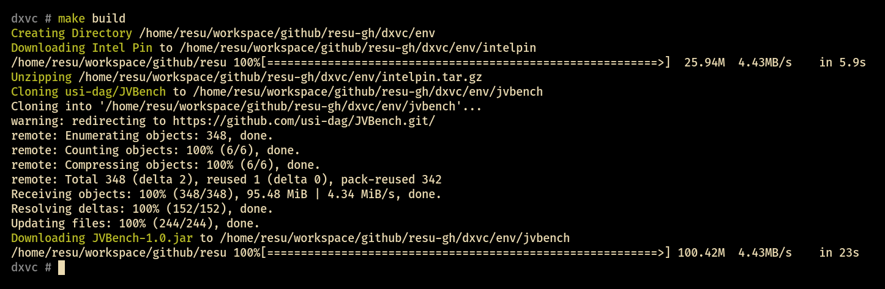

- Cleanup.

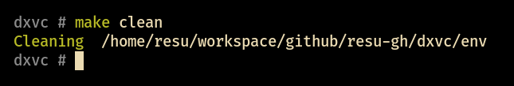

- Rebuild.
- calls `make clean`.

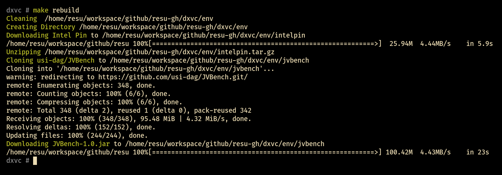

## Compile the `dxvc` Pintool

- The required `PIN_ROOT` env-var is internally setted.
- calls `make build`.

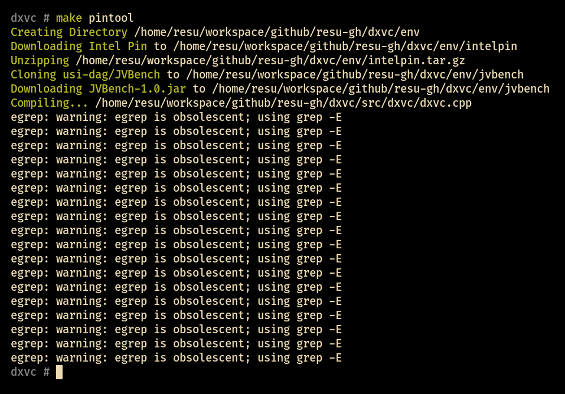

## Run an instrumented benchmark

- The benchmarks of the suite can be executed from the `Makefile` by calling the correct target.
- calls `make build pintool`.
- *Note* that the execution is silenced and the benchmark output is redirected to a `BenchmarkNameTarget.bm.log` file.
    - Use `tail -f BenchmarkNameTarget.bm.log` to view the progress of the execution.

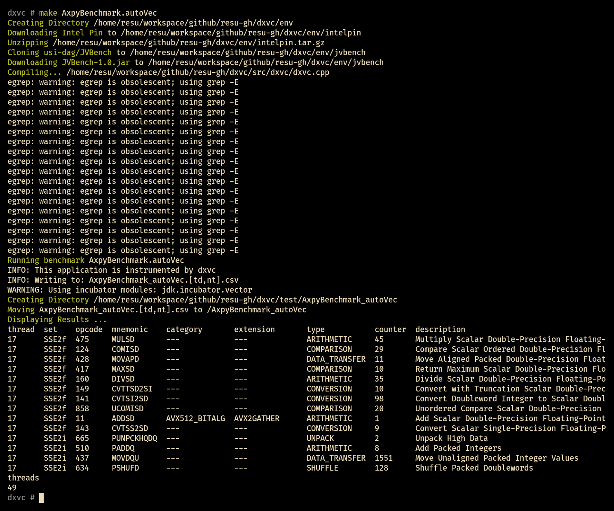

## Cherry-pick execution: `Makefile`

- Concat the targets in this way to execute a list of selected benchmarks.

```bash
user@host:~/dxvc $ make BenchmarkNameTarget1 BenchmarkNameTarget2 ...
```

## Contiguous execution: `Python3` bulk-runner script

```
usage: bulkmk.py [-h] [-j JAR] [-r RANGE [RANGE ...]] [-l]

jvbench benchmarks runner (calls Makefile)

options:
  -h, --help            show this help message and exit
  -j JAR, --jar JAR     jvbench jar path (default:
                        ./env/jvbench/JVBench-1.0.jar)
  -r RANGE [RANGE ...], --range RANGE [RANGE ...]
                        run a list of contiguous benchmarks [begin, end?]
  -l, --list            list available benchmarks w/ indexes
```

- `-j --jar [PATH]` *flag*: 
    - Custom `JVBench` *JAR* path.
    - Use this *flag* if the location of the *JAR* is not `./env/jvbench/JVBench-1.0.jar`.
- `-l --list` *flag*:
    - Prints the list of available benchmarks with indexes (for selection).
- `-r --range [INDEX] or [BEGIN, END]` *flag*:
    - Use this *flag* to execute the selected benchmark: `-r 3` (e.g. the number 3).
    - Use this *flag* to execute a selected contiguous list of benchmarks: `-r 3 52` (e.g. from 3 to 52).
- `-h --help` *flag*:
    - Display help, and exit.

### Benchmark list

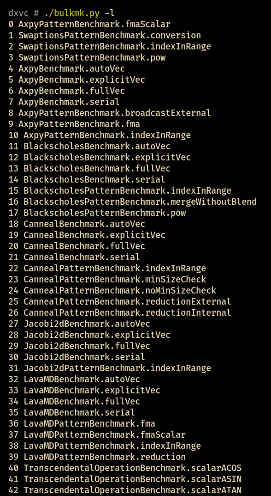

### Single execution (`Makefile` alternative)

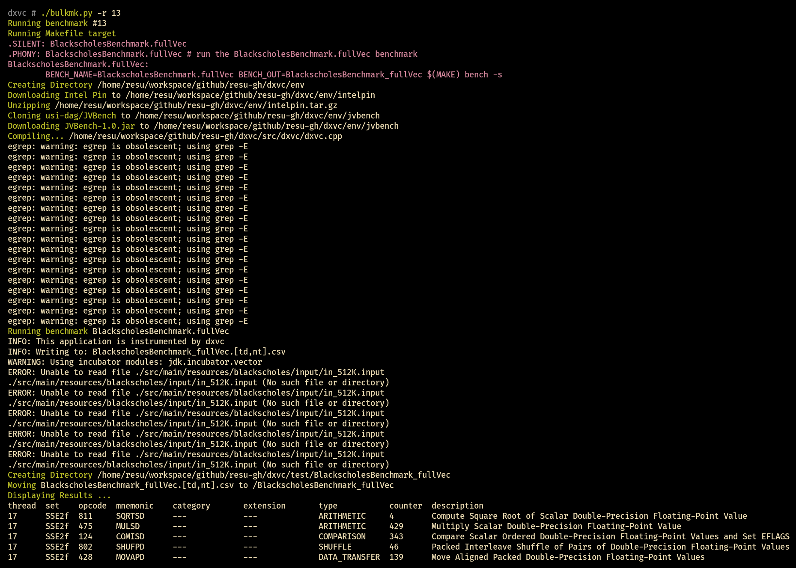

### Bulk execution (`Makefile` alternative)

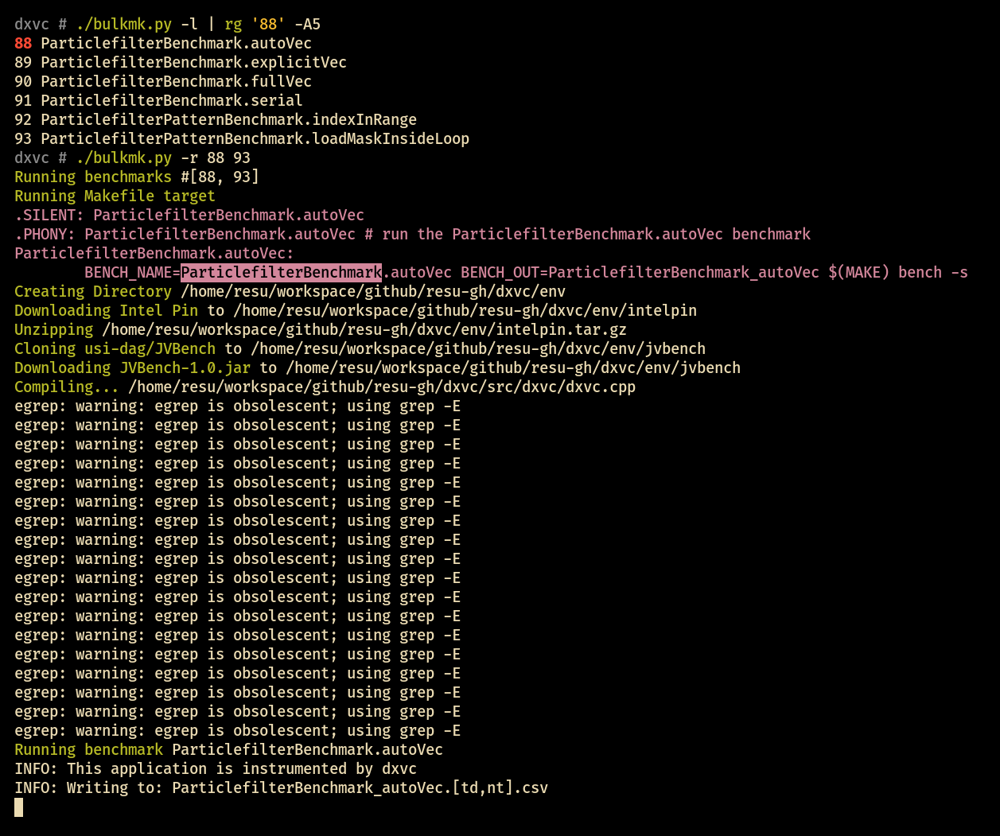

# Notes

## Project

### Statement

- Count the *executed* machine vector instructions (**SIMD** instructions) during a certain *Java Virtual Machine* (**JVM**) execution.

### Requirements

- The solution must work on *Linux Ubuntu*.
- The solution must work on *OpenJDK 18*.
- The solution should report the number of *executed vector instructions* (counter).

### Good-to-have features

- Consider only the *machine vector instructions* emitted by the *Just-In-Time* (**JIT**) compiler (i.e., the **C2** *JIT compiler*).
- Report different counters for different types of instructions (e.g., *load/store*, *arithmetics*, etc.).
- Report *thread-local* counters (instead of *single global counter* per type).
- Expose a *Java API* to reset counters.

### Workload

- Use the following *benchmark* to *test* the solution [jvbench](https://github.com/usi-dag/jvbench)

### Suggested examples of solution

1. Modify the *C2 compiler* and the *JVM* (the `c/c++` codebase at [openjdk18u](https://github.com/openjdk/jdk18u)) to emit additional instrumentation code that increments some *thread-local* counters and dump them on a file at the *VM/Thread* death.
2. Use existing tools such as [Intel Pin](https://www.intel.com/content/www/us/en/developer/articles/tool/pin-a-dynamic-binary-instrumentation-tool.html).

### Deadline

- October 14

## Setup

### OpenJDK 18 Updates

```bash
user@host:~ $ git clone https://github.com/openjdk/jdk18u jdk18u
user@host:~ $ cd jdk18u
```

##### Dependencies

- [Toolchain](https://github.com/openjdk/jdk18u/blob/master/doc/building.md#native-compiler-toolchain-requirements).
- [Build tools](https://github.com/openjdk/jdk18u/blob/master/doc/building.md#build-tools-requirements).
- [External libraries](https://github.com/openjdk/jdk18u/blob/master/doc/building.md#external-library-requirements).
- [Boot JDK](https://github.com/openjdk/jdk18u/blob/master/doc/building.md#boot-jdk-requirements) (e.g. `openjdk18`).

##### Notes

- Due to errors in the `c/c++` codebase, the flag `--disable-warnings-as-erros` must be used in the configuration phase.

```bash
user@host:~/jdk18u $ bash configure --disable-warnings-as-erros
user@host:~/jdk18u $ make images
```

##### Optional steps

- Verify the newly build *JDK* version: `./build/*/images/jdk/bin/java -version`.
- Run a basic test: `make run-test-tier1`.

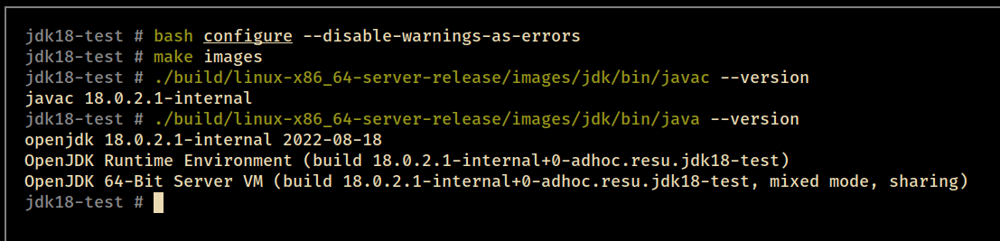

### JVBench

- Collection of diverse benchmarks that execise the *Java Vector API* on typical SIMD workloads.

##### Dependencies

- *OpenJDK Hotspot JDK* `openjdk >= 16`.

```bash
user@host:~ $ git clone https://github.com/usi-dag/jvbench jvbench
user@host:~ $ cd jvbench
```

#### 1) Build

##### Dependencies

- *Apache Maven* `maven >= 3.8`.

##### Notes

- To use the generated *JDK*, set the `JAVA_HOME` environment variable.

```bash
user@host:~/jvbench $ JAVA_HOME=~/jdk18u/build/*/images/jdk mvn clean package
```

#### 2) Use the suite JAR

##### Notes

- To use the generated *JDK*, run using the local paths for `java` and modules.

```bash
user@host:~/jvbench $ ../jdk18u/build/*/images/jdk/bin/java --module-path ../jdk18u/build/*/images/jmods --add-modules jdk.incubator.vector -jar -Dsize=70000 -jar ./JVBench-1.0.jar "AxpyBenchmark"
```

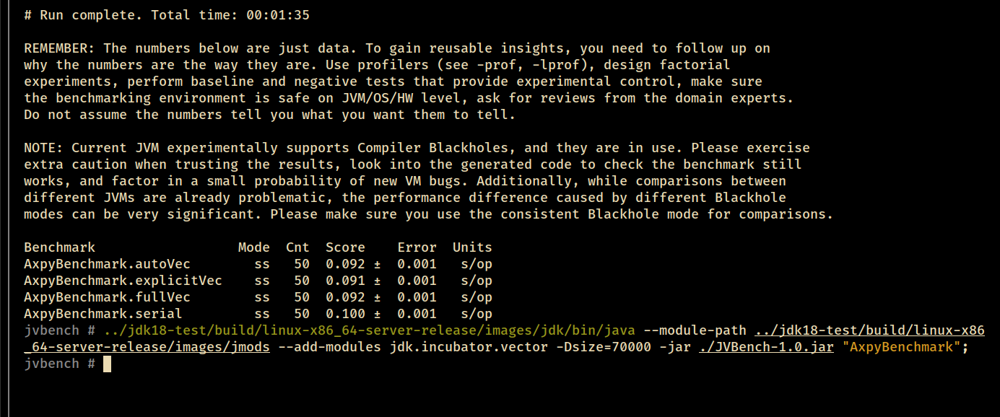

## x86 SSE (Streaming SIMD Extensions)

### Instructions (example)

#### Floating-point
- *Data movements*
    - (scalar) `MOVSS`
    - (packed) `MOVAPS`, `MOVUPS`, `MOVLPS`, `MOVHPS`, `MOVLHPS`, `MOVHLPS`, `MOVMSKPS`
- *Arithmetic*
    - (scalar) `ADDSS`, `SUBSS`, `MULSS`, `DIVSS`, `RCPSS`, `SQRTSS`, `MAXSS`, `MINSS`, `RSQRTSS`
    - (packed) `ADDPS`, `SUBPS`, `MULPS`, `DIVPS`, `RCPPS`, `SQRTPS`, `MAXPS`, `MINPS`, `RSQRTPS`
- *Compare*
    - (scalar) `CMPSS`, `COMISS`, `UCOMISS`
    - (packed) `CMPPS`
- *Data shuffle/unpacking*
    - (packed) `SHUFPS`, `UNPCKHPS`, `UNPCKLPS`
- *Data-type conversion*
    - (scalar) `CVTSI2SS`, `CVTSS2SI`, `CVTTSS2SI`
    - (packed) `CVTPI2PS`, `CVTPS2PI`, `CVTTPS2PI`
- *Bitwise logical operations*
    - (packed) `ANDPS`, `ORPS`, `XORPS`, `ANDNPS`

#### Integer
- *Arithmetic*
    - `PMULHUW`, `PSADBW`, `PAVGB`, `PAVGW`, `PMAXUB`, `PMINUB`, `PMAXSW`, `PMINSW`
- *Data movements*
    - `PEXTRW`, `PINSRW`
- *Others*
    - `PMOVMSKB`, `PSHUFW`

#### Others
- *MXCSR management*
    - `LDMXCSR`, `STMXCSR`
- *Cache/Memory management*
    - `MOVNTQ`, `MOVNTPS`, `MASKMOVQ`, `PREFETCH0`, `PREFETCH1`, `PREFETCH2`, `PREFETCHNTA`, `SFENCE`

## Solution 1 analysis (partial)

### OpenJDK Hotspot analysis

#### Introduction

- Builds the *JVM* and other parts of the *JDK*.
- Around 20 years of development
- Arount 3000 `c/c++` header and source files.
- More than 1.2 million lines of code.
- Complex architecture:
    - Class loader
    - Bytecode interpreter
    - Support for runtime routines
    - 2/3 *JIT* compilers from bytecode to native instructions
    - Several garbage collectors
    - A set of high-performance runtime libraries for synchronization
    - etc. ...

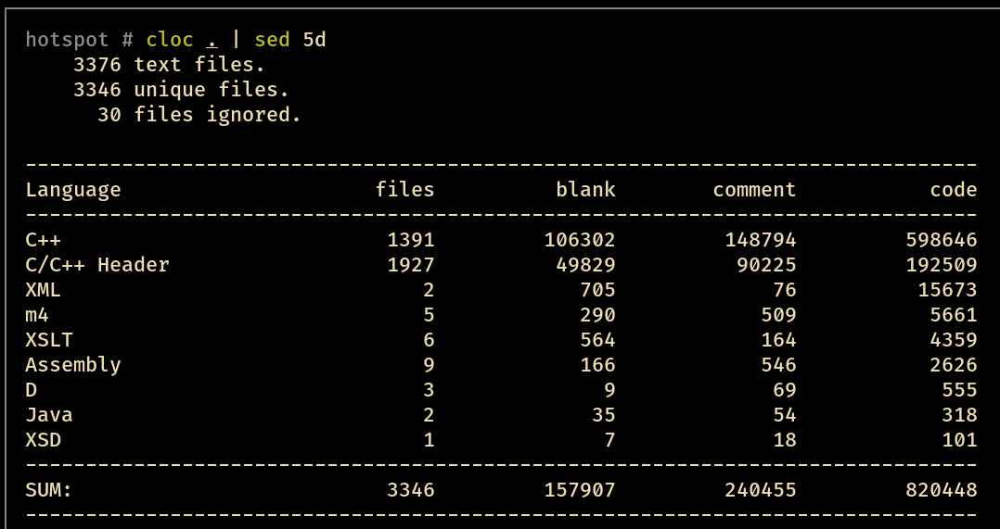

#### Issues

- The codebase is very large and poorly documented
- The official external documentation is rather fragmented
- Low community activity despite the project has a copyleft/free licence
- Lack of compiler-developer oriented documentation

#### Useful links

- [Hotspot Docs](https://openjdk.org/groups/hotspot)
- [Hotspot Docs Glossary](https://openjdk.org/groups/hotspot/docs/HotSpotGlossary.html)
- [Hotspot Docs Runtime](https://openjdk.org/groups/hotspot/docs/RuntimeOverview.html)
- [Hotspot Docs Serviceability](https://openjdk.org/groups/hotspot/docs/Serviceability.html)
- [Hotspot Docs Storage Management](https://openjdk.org/groups/hotspot/docs/StorageManagement.html)
- [Hotspot Wiki](https://wiki.openjdk.org/display/HotSpot) (incomplete)
- Hotspot mailing lists (cumbersome to consult)

#### Useful links (anchors)

- [Hotspot Unified JVM Logging](https://openjdk.org/guide/#hotspot-development)

#### Useful links `openjdk/jdk18u/doc`

- [Hotspot IDE Support and `compile-commands` db](https://github.com/openjdk/jdk18u/blob/master/doc/ide.md)
- [Hotspot Coding Style](https://github.com/openjdk/jdk18u/blob/master/doc/hotspot-style.md)
- [Hotspot Native/Unit Testing (`gtest`)](https://github.com/openjdk/jdk18u/blob/master/doc/hotspot-unit-tests.md)
- [Hotspot Testing](https://github.com/openjdk/jdk18u/blob/master/doc/testing.md)

#### Glossary (stripped dump)

- *Block start table*
    - A table that shows, for a region of the heap, where the object starts that comes on to this region from lower addresees. Used, for example, with the card table variant of the remembered set.
- *C1 compiler*
    - Fast, lightly optimizing bytecode compiler. Performs some value numbering, inlining, and class analysis. Uses a simple CFG-oriented SSA "high" IR, a machine-oriented "low" IR, a linear scan register allocation, and a template-style code generator.
- *C2 compiler*
    - Highly optimizing bytecode compiler, also known as 'opto'. Uses a "sea of nodes" SSA "ideal" IR, which lowers to a machine-specific IR of the same kind. Has a graph-coloring register allocator; colors all machine state, including local, global, and argument registers and stack. Optimizations include global value numbering, conditional constant type propagation, constant folding, global code motion, algebraic identities, method inlining (aggressive, optimistic, and/or multi-morphic), intrinsic replacement, loop transformations (unswitching, unrolling), array range check elimination.
- *Card table*
    - A kind of remembered set that records where oops have changed in a generation.
- *Code cache*
    - A special heap that holds compiled code. These objects are not relocated by the GC, but may contain oops, which serve as GC roots.
- *Deoptimization*
    - The process of converting an compiled (or more optimized) stack frame into an interpreted (or less optimized) stack frame. Also describes the discarding of an nmethod whose dependencies (or other assumptions) have been broken. Deoptimized nmethods are typically recompiled to adapt to changing application behavior. Example: A compiler initially assumes a reference value is never null, and tests for it using a trapping memory access. Later on, the application uses null values, and the method is deoptimized and recompiled to use an explicit test-and-branch idiom to detect such nulls.
- *Garbage collection root*
    - A pointer into the Java object heap from outside the heap. These come up, e.g., from static fields of classes, local references in activation frames, etc.
- *GC map*
    - A description emitted by the JIT (C1 or C2) of the locations of oops in registers or on stack in a compiled stack frame. Each code location which might execute a *safepoint* has an associated GC map. The GC knows how to parse a frame from a stack, to request a GC map from a frame's nmethod, and to unpack the GC map and manage the indicated oops within the stack frame.
- *Generational garbage collection*
    - A storage management technique that separates objects expected to be referenced for different lengths of time into different regions of the heap, so that different algorithms can be applied to the collection of those regions.
- *Handle*
    - A memory word containing an oop. The word is known to the GC, as a root reference. `c/c++` code generally refers to oops indirectly via handles, to enable the GC to find and manage its root set more easily. Whenever `c/c++` code blocks in a *safepoint*, the GC may change any oop stored in a handle. Handles are either 'local' (thread-specific, subject to a stack discipline though not necessarily on the thread stack) or global (long-lived and explicitly deallocated). There are a number of handle implementations throughout the VM, and the GC knows about them all.
- *Interpreter*
    - A VM module which implements method calls by individually executing bytecodes. The interpreter has a limited set of highly stylized stack frame layouts and register usage patterns, which it uses for all method activations. The Hotspot VM generates its own interpreter at start-up time.
- *JIT compilers*
    - An on-line compiler which generates code for an application (or class library) during execution of the application itself. ("JIT" stands for "just in time".) A JIT compiler may create machine code shortly before the first invocation of a Java method. Hotspot compilers usually allow the interpreter ample time to "warm up" Java methods, by executing them thousands of times. This warm-up period allows a compiler to make better optimization decisions, because it can observe (after initial class loading) a more complete class hierarchy. The compiler can also inspect branch and type profile information gathered by the interpreter.
- *JNI*
    - The Java Native Interface - a specification and API for how Java code can call out to native C code, and how native C code can call into the Java VM
- *JVM TI*
    - The Java Virtual Machine Tools Interface - a standard specification and API that is used by development and monitoring tools. See JVM TI for more information.
- *Klass pointer*
    - The second word of every object header. Points to another object (a metaobject) which describes the layout and behavior of the original object. For Java objects, the "klass" contains a `c++` style "vtable".
- *Mark word*
    - The first word of every object header. Usually a set of bitfields including synchronization state and identity hash code. May also be a pointer (with characteristic low bit encoding) to synchronization related information. During GC, may contain GC state bits.
- *Nmethod*
    - A block of executable code which implements some Java bytecodes. It may be a complete Java method, or an 'OSR' method. It routinely includes object code for additional methods inlined by the compiler.
- *Object header*
    - Common structure at the beginning of every GC-managed heap object. (Every oop points to an object header.) Includes fundamental information about the heap object's layout, type, GC state, synchronization state, and identity hash code. Consists of two words. In arrays it is immediately followed by a length field. Note that both Java objects and VM-internal objects have a common object header format.
- *Object promotion*
    - The act of copying an object from one generation to another.
- *Old generation*
    - A region of the Java object heap that holds object that have remained referenced for a while.
- *On-stack replacement*
    - Also known as 'OSR'. The process of converting an interpreted (or less optimized) stack frame into a compiled (or more optimized) stack frame. This happens when the interpreter discovers that a method is looping, requests the compiler to generate a special nmethod with an entry point somewhere in the loop (specifically, at a backward branch), and transfers control to that nmethod. A rough inverse to deoptimization.
- *Oop*
    - An object pointer. Specifically, a pointer into the GC-managed heap. (The term is traditional. One 'o' may stand for 'ordinary'.) Implemented as a native machine address, not a handle. Oops may be directly manipulated by compiled or interpreted Java code, because the GC knows about the liveness and location of oops within such code. (See GC map.) Oops can also be directly manipulated by short spans of `c/c++` code, but must be kept by such code within handles across every *safepoint*.
- *Permanent generation*
    - A region of the address space that holds object allocated by the virtual machine itself, but which is managed by the garbage collector. The permanent generation is mis-named, in that almost all of the objects in it can be collected, though they tend to be referenced for a long time, so they rarely become garbage.
- *Remembered set*
    - A data structure that records pointers between generations.
- *Safepoint*
    - A point during program execution at which all GC roots are known and all heap object contents are consistent. From a global point of view, all threads must block at a *safepoint* before the GC can run. (As a special case, threads running JNI code can continue to run, because they use only handles. During a *safepoint* they must block instead of loading the contents of the handle.) From a local point of view, a *safepoint* is a distinguished point in a block of code where the executing thread may block for the GC. Most call sites qualify as *safepoint*. There are strong invariants which hold true at every *safepoint*, which may be disregarded at *non-safepoints*. Both compiled Java code and `c/c++` code be optimized between *safepoints*, but less so across *safepoints*. The JIT compiler emits a GC map at each *safepoint*. `c/c++` code in the VM uses stylized macro-based conventions (e.g., TRAPS) to mark potential *safepoints*.
- *Sea-of-nodes*
    - The high-level intermediate representation in C2. It is an SSA form where both data and control flow are represented with explicit edges between nodes. It differs from forms used in more traditional compilers in that nodes are not bound to a block in a control flow graph. The IR allows nodes to float within the sea (subject to edge constraints) until they are scheduled late in the compilation process.
- *Serviceability Agent (SA)*
    - The Serviceablity Agent is collection of Sun internal code that aids in debugging HotSpot problems. It is also used by several JDK tools - jstack, jmap, jinfo, and jdb. See SA for more information.
- *Stackmap*
    - Refers to the StackMapTable attribute or a particular StackMapFrame in the table.
- *StackMapTable*
    - An attribute of the Code attribute in a classfile which contains type information used by the new verifier during verification. It consists of an array of StackMapFrames. It is generated automatically by javac as of JDK6.
- *Survivor space*
    - A region of the Java object heap used to hold objects. There are usually a pair of survivor spaces, and collection of one is achieved by copying the referenced objects in one survivor space to the other survivor space.
- *TLAB*
    - Thread-local allocation buffer. Used to allocate heap space quickly without synchronization. Compiled code has a "fast path" of a few instructions which tries to bump a high-water mark in the current thread's TLAB, successfully allocating an object if the bumped mark falls before a TLAB-specific limit address.
- *Uncommon trap*
    - When code generated by C2 reverts back to the interpreter for further execution. C2 typically compiles for the common case, allowing it to focus on optimization of frequently executed paths. For example, C2 inserts an uncommon trap in generated code when a class that is uninitialized at compile time requires run time initialization.
- *VM Operations*
    - Operations in the VM that can be requested by Java threads, but which must be executed, in serial fashion by a specific thread known as the VM thread. These operations are often synchronous, in that the requester will block until the VM thread has completed the operation. Many of these operations also require that the VM be brought to a *safepoint* before the operation can be performed - a garbage collection request is a simple example.
- *Write barrier*
    - Code that is executed on every oop store. For example, to maintain a remembered set.
- *Young generation*
    - A region of the Java object heap that holds recently-allocated objects.

#### Runtime system (reduced dump)

##### CLI argument processing (reduced dump)

- *Standard*:
    - Options that are expected to be accepted by all JVM implementations and are stable between releases (though they can be deprecated).
- *Non-Standard:*
    - Options that begin with `-X`. They are not guaranteed to be supported on all JVM implementations and they are subject to change without notice in subsequent releases of the Java SDK.
- *Developer*:
    - Options that begin with `-XX`. They often have specific system requirements for correct operation and may require privileged access to system configuration parameters.
    
##### VM lifecycle - Lancher (reduced dump)

1. Parse the command line options and send them to the Launcher itself and to the VM using `JavaVMInitArgs`.
2. Establish the heap sizes and the compiler type (client or server) if these options are not explicitly specified on the command line. Establishes the environment variables such as `LD_LIBRARY_PATH` and `CLASSPATH`.
3. If the java Main-Class is not specified on the command line it fetches the Main-Class name from the `JAR`'s manifest.
4. Creates the VM using `JNI_CreateJavaVM` in a newly created thread (non primordial thread).
5. Once the VM is created and initialized, the Main-Class is loaded, and the launcher gets the main method's attributes from the Main-Class.
6. The java main method is then invoked in the VM using `CallStaticVoidMethod`, using the marshalled arguments from the command line.
7. Once the java main method completes, its very important to check and clear any pending exceptions that may have occurred and also pass back the exit status, the exception is cleared by calling `ExceptionOccurred`, the return value of this method is 0 if successful, any other value otherwise, this value is passed back to the calling process.
8. The main thread is detached using `DetachCurrentThread`, by doing so we decrement the thread count so the `DestroyJavaVM` can be called safely, also to ensure that the thread is not performing operations in the VM and that there are no active java frames on its stack.

##### VM lifecycle - `JNI_CreateJavaVM` in detail (reduced dump)
1. Ensures that no 2 threads call this method at the same time and that no 2 *VM* instances are created in the same process.
2. Checks to make sure the *JNI* version is supported, and the ostream is initialized for gc logging. The *OS* modules are initialized such as the random number generator, the current pid, high-resolution time, memory page sizes, and the guard pages.
3. The arguments and properties passed in are parsed and stored away for later use. The standard java system properties are initialized.
4. The *OS* modules are further created and initialized, based on the parsed arguments and properties, are initialized for synchronization, stack, memory, and *safepoint* pages. At this time other libraries such as `libzip`, `libhpi`, `libjava`, `libthread` are loaded, signal handlers are initialized and set, and the thread library is initialized.
5. The output stream logger is initialized. Any agent libraries (`hprof`, `jdi`) required are initialized and started.
6. The thread states and the thread local storage (*TLS*), which holds several thread specific data required for the operation of threads, are initialized.
7. The global data is initialized as part of the I phase, such as event log, *OS* synchronization primitives, perfMemory (performance memory), chunkPool (memory allocator).
8. At this point, we can create Threads. The Java version of the main thread is created and attached to the current *OS* thread. However this thread will not be yet added to the known list of the Threads. The *Java* level synchronization is initialized and enabled.
9. The rest of the global modules are initialized such as the *BootClassLoader*, *CodeCache*, *Interpreter*, *Compiler*, *JNI*, *SystemDictionary*, and *Universe*.
10. The main thread is added to the list, by first locking the Thread_Lock. The Universe, a set of required global data structures, is sanity checked. The VMThread, which performs all the *VM*'s critical functions, is created. At this point the appropriate JVMTI events are posted to notify the current state.
11. The following classes `java.lang.String`, `java.lang.System`, `java.lang.Thread`, `java.lang.ThreadGroup`, `java.lang.reflect.Method`, `java.lang.ref.Finalizer`, `java.lang.Class`, and the rest of the System classes, are loaded and initialized. At this point, the *VM* is initialized and operational, but not yet fully functional.
12. The *Signal Handler* thread is started, the compilers are initialized and the *CompileBroker* thread is started. The other helper threads *StatSampler* and WatcherThreads are started, at this time the *VM* is fully functional, the JNIEnv is populated and returned to the caller, and the *VM* is ready to service new *JNI* requests.

##### VM lifecycle - `DestroyJavaVM` in detail (reduced dump)

This method can be called from the launcher to tear down the *VM*, it can also be called by the *VM* itself when a very serious error occurs.

1. Wait until we are the last non-daemon thread to execute, noting that the VM is still functional.
2. Call `java.lang.Shutdown.shutdown()`, which will invoke Java level shutdown hooks, run finalizers if finalization-on-exit.
3. Call `before_exit()`, prepare for *VM* exit run *VM* level shutdown hooks (they are registered through JVM_OnExit()), stop the Profiler, StatSampler, Watcher and GC threads. Post the status events to JVMTI/PI, disable JVMPI, and stop the Signal thread.
4. Call `JavaThread::exit()`, to release *JNI* handle blocks, remove stack guard pages, and remove this thread from Threads list. From this point on we cannot execute any more Java code.
5. Stop *VM* thread, it will bring the remaining *VM* to a *safepoint* and stop the compiler threads. At a *safepoint*, care should that we should not use anything that could get blocked by a *Safepoint*.
6. Disable tracing at *JNI*/*JVM*/*JVMPI* barriers.
7. Set `_vm_exited` flag for threads that are still running native code.
8. Delete this thread.
9. Call `exit_globals()`, which deletes IO and PerfMemory resources.
10. Return to caller.

##### VM Class Loading (reduced dump)

- The *VM* is responsible for resolving constant pool symbols, which requires loading, linking and then initializing classes and interfaces.
- The most common reason for class loading is during bytecode resolution, when a constant pool symbol in the classfile requires resolution.
-  Loading a class requires loading all superclasses and superinterfaces. And classfile verification, which is part of the linking phase, can require loading additional classes.
- The *VM* and Java SE class loading libraries share the responsibility for class loading. The *VM* performs constant pool resolution, linking and initialization for classes and interfaces. The loading phase is a cooperative effort between the *VM* and specific class loaders (`java.lang.classLoader`)

##### Class Metadata in HotSpot (dump)

- Class loading creates either an `instanceKlass` or an `arrayKlass` in the *GC* permanent generation. The `instanceKlass` refers to a java mirror, which is the instance of `java.lang.Class` mirroring this class. The *VM* `c++` access to the `instanceKlass` is via a `klassOop`.

##### HotSpot Internal Class Loading Data (dump)

- The *HotSpot VM* maintains 3 main hash tables to track class loading.
    - The `SystemDictionary` contains loaded classes, which maps a class name/class loader pair to a `klassOop`.
    - The `SystemDictionary` contains both class name/initiating loader pairs and class name/defining loader pairs. Entries are currently only removed at a *safepoint*.
    - The `PlaceholderTable` contains classes which are currently being loaded. It is used for `ClassCircularityError` checking and for parallel class loading for class loaders that support multi-threaded classloading. The `LoaderConstraintTable` tracks constraints for type safety checking.
- These hash tables are all protected by the `SystemDictionary_lock`. In general the load class phase in the *VM* is serialized using the Class loader object lock.

##### Synchronization (reduced dump)

- HotSpot provides Java monitors by which threads running application code may participate in a mutual exclusion protocol. A monitor is either *locked* or *unlocked*, and only one thread may own the monitor at any one time. Only after acquiring ownership of a monitor may a thread enter the critical section protected by the monitor. In Java, critical sections are referred to as *synchronized blocks*, and are delineated in code by the `synchronized` statement.
- If a thread attempts to lock a monitor and the monitor is in an unlocked state, the thread will immediately gain ownership of the monitor. If a subsequent thread attempts to gain ownership of the monitor while the monitor is locked that thread will not be permitted to proceed into the critical section until the owner releases the lock and the 2nd thread manages to gain (or is granted) exclusive ownership of the lock.
- The HotSpot *VM* incorporates leading-edge techniques for both *uncontended* and *contended* synchronization operations:
    - *Uncontended:* which comprise the majority of synchronizations, are implemented with constant-time techniques. With biased locking, in the best case these operations are essentially free of cost.
    - *Contended:* use advanced adaptive spinning techniques to improve throughput even for applications with significant amounts of lock contention.
- In HotSpot, most synchronization is handled through what we call *fast-path* code. We have two just-in-time compilers (JITs) and an interpreter, all of which will emit fast-path code. The two JITs are *C1*, which is the `-client` compiler, and *C2*, which is the `-server` compiler. *C1* and *C2* both emit fast-path code directly at the synchronization site. In the normal case when there's no contention, the synchronization operation will be completed entirely in the fast-path. If, however, we need to block or wake a thread (in `monitorenter` or `monitorexit`, respectively), the *fast-path* code will call into the *slow-path*. The *slow-path* implementation is in native `c++` code while the *fast-path* is emitted by the *JITs*.
- Per-object synchronization state is encoded in the *first word* (the so-called *mark word*) of the *VM*'s object representation. For several states, the mark word is multiplexed to point to additional synchronization metadata. (As an aside, in addition, the mark word is also multiplexed to contain *GC* age data, and the object's identity hashCode value.)
- The states are:
    - *Neutral*: Unlocked.
    - *Biased*: Locked/Unlocked + Unshared.
    - *Stack-Locked*: Locked + Shared but uncontended The mark points to displaced mark word on the owner thread's stack.
    - *Inflated*: Locked/Unlocked + Shared and contended. Threads are blocked in `monitorenter` or `wait()`. The mark points to heavy-weight `objectmonitor` structure.

##### Thread Management (dump)

- Thread management covers all aspects of the thread lifecycle, from creation through to termination, and the coordination of threads within the *VM*. This involves management of threads created from Java code (whether application code or library code), native threads that attach directly to the *VM*, or internal *VM* threads created for a range of purposes. While the broader aspects of thread management are platform independent, the details necessarily vary depending on the underlying operating system.

##### Threading Model (reduced dump)

- The basic threading model in Hotspot is a 1:1 mapping between Java threads (an instance of java.lang.Thread) and native operating system threads. The native thread is created when the Java thread is started, and is reclaimed once it terminates. The operating system is responsible for scheduling all threads and dispatching to any available CPU.

##### Thread Creation and Destruction (reduced dump)

- There are two basic ways for a thread to be introduced into the *VM*:
    - Execution of Java code that calls `start()` on a `java.lang.Thread` object
    - Attaching an existing native thread to the *VM* using *JNI*.
- There are a number of objects associated with a given thread in the *VM*:
    - The `java.lang.Thread` instance that represents a thread in Java code
    - A `JavaThread` instance that represents the `java.lang.Thread` instance inside the *VM*. It contains additional information to track the state of the thread. A `JavaThread` holds a reference to its associated `java.lang.Thread` object (as an oop), and the `java.lang.Thread` object also stores a reference to its `JavaThread` (as a raw int). A `JavaThread` also holds a reference to its associated `OSThread` instance.
    - An `OSThread` instance represents an operating system thread, and contains additional operating-system-level information needed to track thread state. The `OSThread` then contains a platform specific *handle* to identify the actual thread to the operating system
- When a `java.lang.Thread` is started the *VM* creates the associated `JavaThread` and `OSThread` objects, and ultimately the native thread. After preparing all of the *VM* state (such as thread-local storage and allocation buffers, synchronization objects and so forth) the native thread is started. The native thread completes initialization and then executes a start-up method that leads to the execution of the `java.lang.Thread` object's run() method, and then, upon its return, terminates the thread after dealing with any uncaught exceptions, and interacting with the *VM* to check if termination of this thread requires termination of the whole *VM*. Thread termination releases all allocated resources, removes the `JavaThread` from the set of known threads, invokes destructors for the `OSThread` and `JavaThread` and ultimately ceases execution when it's initial startup method completes.
- A native thread attaches to the *VM* using the *JNI* call AttachCurrentThread. In response to this an associated `OSThread` and `JavaThread` instance is created and basic initialization is performed. Next a `java.lang.Thread` object must be created for the attached thread, which is done by reflectively invoking the Java code for the Thread class constructor, based on the arguments supplied when the thread attached. Once attached, a thread can invoke whatever Java code it needs to via the other *JNI* methods available. Finally when the native thread no longer wishes to be involved with the *VM* it can call the *JNI* `DetachCurrentThread` method to disassociate it from the *VM* (release resources, drop the reference to the `java.lang.Thread` instance, destruct the `JavaThread` and `OSThread` objects and so forth).
- A special case of attaching a native thread is the initial creation of the *VM* via the *JNI* `CreateJavaVM` call, which can be done by a native application or by the launcher (java.c). This causes a range of initialization operations to take place and then acts effectively as if a call to AttachCurrentThread was made. The thread can then invoke Java code as needed, such as reflective invocation of the main method of an application.

##### Thread States (reduced dump)

- The *VM* uses a number of different internal thread states to characterize what each thread is doing. This is necessary both for coordinating the interactions of threads, and for providing useful debugging information if things go wrong.
- The main thread states from the *VM* perspective are as follows:
    - `_thread_new`: a new thread in the process of being initialized
    - `_thread_in_Java`: a thread that is executing Java code
    - `_thread_in_vm`: a thread that is executing inside the *VM*
    - `_thread_blocked`: the thread is blocked for some reason (acquiring a lock, waiting for a condition, sleeping, performing a blocking I/O operation and so forth)
- For debugging purposes additional state information is also maintained for reporting by tools, in thread dumps, stack traces etc. This is maintained in the `OSThread` and some of it has fallen into dis-use, but states reported in thread dumps etc include:
    - `MONITOR_WAIT`: a thread is waiting to acquire a contended monitor lock
    - `CONDVAR_WAIT`: a thread is waiting on an internal condition variable used by the *VM* (not associated with any Java level object)
    - `OBJECT_WAIT`: a thread is performing an `Object.wait()` call
- Other subsystems and libraries impose their own state information, such as the *JVMTI* system and the `ThreadState` exposed by the `java.lang.Thread` class itself. Such information is generally not accessible to, nor relevant to, the management of threads inside the *VM*.

##### Internal *VM* Threads (reduced dump)

- Executing a simple *Hello World* program can result in the creation of a dozen or more threads in the system. These arise from a combination of internal *VM* threads, and library related threads (such as reference handler and finalizer threads).
- The main kinds of *VM* threads are as follows:
    - *VM thread*: This singleton instance of `VMThread` is responsible for executing *VM* operations
    - *Periodic task thread*: This singleton instance of `WatcherThread` simulates timer interrupts for executing periodic operations within the *VM*
    - *GC threads*: These threads, of different types, support parallel and concurrent garbage collection
    - *Compiler threads*: These threads perform runtime compilation of bytecode to native code
    - *Signal dispatcher thread*: This thread waits for process directed signals and dispatches them to a Java level signal handling method
- All threads are instances of the `Thread` class, and all threads that execute Java code are `JavaThread` instances (a subclass of `Thread`). The *VM* keeps track of all threads in a linked-list known as the `Threads_list`, and which is protected by the `Threads_lock` – one of the key synchronization locks used within the *VM*.

##### VM Operations and Safepoints (reduced dump)

- The VMThread spends its time waiting for operations to appear in the `VMOperationQueue`, and then executing those operations. Typically these operations are passed on to the `VMThread` because they require that the *VM* reach a *safepoint* before they can be executed. In simple terms, when the *VM* is at *safepoint* all threads inside the *VM* have been blocked, and any threads executing in native code are prevented from returning to the *VM* while the *safepoint* is in progress. This means that the *VM* operation can be executed knowing that no thread can be in the middle of modifying the Java heap, and all threads are in a state such that their Java stacks are unchanging and can be examined.
- The most familiar *VM* operation is for *garbage collection*, or more specifically for the *stop-the-world* phase of garbage collection that is common to many garbage collection algorithms. But many other *safepoint* based *VM* operations exist, for example: *biased locking revocation*, *thread stack dumps*, *thread suspension* or *stopping* (i.e. The `java.lang.Thread.stop()` method) and numerous *inspection/modification* operations requested through *JVMTI*.
- Many *VM* operations are *synchronous*, that is the requestor blocks until the operation has completed, but some are *asynchronous* or *concurrent*, meaning that the requestor can proceed in parallel with the `VMThread` (assuming no *safepoint* is initiated of course).
- *Safepoints* are initiated using a cooperative, polling-based mechanism. Once a *safepoint* has been requested, the `VMThread` must wait until all threads are known to be in a *safepoint-safe* state before proceeding to execute the *VM* operation. During a *safepoint* the `Threads_lock` is used to block any threads that were running, with the `VMThread` finally releasing the `Threads_lock` after the *VM* operation has been performed.

##### C++ Heap Management (reduced dump)

- In addition to the Java heap, which is maintained by the Java heap manager and garbage collectors, HotSpot also uses the `c/c++` heap (also called the malloc heap) for storage of *VM*-internal objects and data. A set of `c++` classes derived from the base class `Arena` is used to manage `c++` heap operations.
- `Arena` and its subclasses provide a fast allocation layer that sits on top of `malloc/free`. Each `Arena` allocates memory blocks (or Chunks) out of 3 global `ChunkPools`. Each `ChunkPool` satisfies allocation requests for a distinct range of allocation sizes. This is done to avoid wasteful memory fragmentation.
- The `Arena` system also provides better performance than pure `malloc/free`. The latter operations may require acquisition of global OS locks, which affects scalability and can hurt performance. `Arenas` are *thread-local objects* which *cache* a certain amount of storage, so that in the *fast-path* allocation case a lock is not required. Likewise, `Arena` free operations do not require a lock in the common case.
- `Arenas` are used for *thread-local* *resource* management (`ResourceArea`) and *handle* management (`HandleArea`). They are also used by both the client and server compilers during compilation.

##### Java Native Interface (*JNI*) (reduced dump)

- The *JNI* is a *native programming interface*. It allows `Java` code that runs inside a *Java virtual machine* to interoperate with applications and libraries written in other programming languages, such as `c`, `c++`, and `assembly`.
- *JNI* native methods can be used to create, inspect, and update Java objects, call Java methods, catch and throw exceptions, load classes and obtain class information, and perform runtime type checking.
- The *JNI* may also be used with the *Invocation API* to enable an arbitrary native application to embed the Java *VM*. This allows programmers to easily make their existing applications Java-enabled without having to link with the *VM* source code.
- It is important to remember that once an application uses the *JNI*, it risks losing two benefits of the Java platform.
    1. Java applications that depend on the *JNI* can no longer readily run on multiple host environments. Even though the part of an application written in the Java programming language is portable to multiple host environments, it will be necessary to recompile the part of the application written in native programming languages.
    2. While the Java programming language is *type-safe* and *secure*, native languages such as `c` or `c++` are not. As a result, Java developers must use extra care when writing applications using the *JNI*. A misbehaving native method can corrupt the entire application. For this reason, Java applications are subject to security checks before invoking *JNI* features.
- In HotSpot, the implementation of the *JNI* functions is relatively straightforward. It uses various *VM internal primitives* to perform activities such as object creation, method invocation, etc. In general, these are the same runtime primitives used by other subsystems such as the interpreter.
- A command line option, `-Xcheck:jni`, is provided to aid in debugging problems in *JNI* usage by native methods. Specifying `-Xcheck:jni` causes an alternate set of debugging interfaces to be used by *JNI* calls. The alternate interface verifies arguments to *JNI* calls more stringently, as well as performing additional internal consistency checks.
- HotSpot must take special care to keep track of which threads are currently executing in native methods. During some *VM* activities, notably some phases of garbage collection, one or more threads must be halted at a *safepoint* in order to guarantee that the Java memory heap is not modified during the sensitive activity. When we wish to bring a thread executing in native code to a *safepoint*, it is allowed to continue executing native code, but the thread will be stopped when it attempts to return into Java code or make a *JNI* call.

#### Storage management system (reduced dump)

- Among the facilities that a Java virtual machine has to provide is a storage manager. The storage manager is responsible for the life-cycle of Java objects: allocation of new objects, collection of unreachable objects, and notifications of unreachability if requested.
- The HotSpot virtual machine provides several storage managers, to meet the needs of different kinds of applications. The two main storage managers are one to provide short pauses to the application, and one to provide high throughput.

##### The Klass Hierarchy (reduced dump)

- A central data structure of the HotSpot virtual machine is the *klass hierarchy*: the data structure that describes objects in the managed storage of the virtual machine, and provides all the operations on those objects. The klass hierarchy is self-referential, in that it also contains the descriptions of the descriptions of objects, and so on. Java objects are not C++ objects, so we can not directly invoke methods on them. The klass hierarchy provides a mechanism for methods (and virtual methods) on objects.

##### Allocation (dump)

- Most Java applications allocate objects frequently, and abandon them almost as frequently. So a performant Java virtual machine should support fast allocation of objects, and be prepared for most objects to become unreachable fairly quickly. If you look in the code you will see code that allocates and initializes objects. But that code is what we call the *slow-path* for allocation, in which a running program calling in the virtual machine runtimes to allocate an object. Most object allocation is performed in the *fast-path*, which is compiled into the application, so no calls to the runtime need to be made. In fact, the fast-path is little more than bumping a pointer and checking to make sure it hasn't run off the end of an allocation region. In order to keep that pointer from becoming a scalability bottleneck, each thread has its own allocation region, and it's own pointer. These are what we call *thread-local allocation buffers* (*TLABs*). Each thread can allocate from its *TLAB* without coordinating with other threads, except when it needs a new *TLAB*. Much work has gone into the sizing of *TLABs*, and adjusting their sizes based on the application thread performance, to balance the number of *TLABs* needed, the fragmentation lost due to space held in *TLABs* by inactive threads, etc.

##### Collection (dump)

- Objects eventually become unreferenced, and the storage they occupy can be reclaimed for use by other objects. The basic operation of the collector is to traverse the object graph, finding all the reachable objects and preserving them, while identifying all the objects that are unreachable and recovering their storage. It would be prohibitively expensive to traverse the entire object graph for each collection, so a variety of techniques have been applied to make collections more efficient.
Generations
- We've observed that most Java programs follow the *weak generational hypothesis*: that objects are allocated frequently, but most are not referenced for long, and that few references exist between old objects and young objects. To exploit that, we partition the Java objects into *generations* so that we can apply different algorithms for managing newly-created objects and objects that objects that have remained referenced for a while. In the *young* generation we expect there to be a lot of object allocation, but also a high density of unreachable objects. In the old generation we expect there not to be a lot of object allocation (in fact the only object allocation in the old generation is the *promotion* of objects from the young generation by the storage manager, or a few objects that are allocated directly in the old generation for special reasons). But once objects in the old generation we expect them to remain referenced for a while, and so use different algorithms to manage them.

##### The Young Generation (reduce dump)

- The young generation must support *fast allocation*, but we expect most of those objects to become unreachable fairly quickly. So when our young generations need to be collected, we identify the *lreachable* objects in them and copy them out of the young generation. Once we've copied out the reachable objects, the objects remaining in the young generation are unreachable, and the space for them can be recovered without attention to each individual unreachable object. This operation of copying the reachable objects out of a generation we call *scavenging*, so we often refer to our young generation collectors as *scavengers*. An advantage of scavenging is that it is fast. A disadvantage is that it requires room of a second copy of all the reachable objects from the scavenged generation.
To identify the reachable objects in the young generation without traversing the whole object graph we take advantage of the second part of the *weak generational hypothesis*: that there are few references from old objects to young objects. We keep what is called a *remembered set* of references from the old generation to the young generation. The current HotSpot collectors use a *card marking* remembered set, which bounds the size of the remembered set at the cost of some extra work during collections. That extra work comes from the fact that the remember set is imprecise, so we need to be able to walk backwards through the old generation looking for the start of objects. To facilitate that we have a *block start* table (also bounded in size) which you will see if you look in the code. In addition, the different collectors have some *collector-specific ancillary data structures*.

##### The Old Generation (dump)

- Once objects have been scavenged out of the young generation we expect them to remain reachable for at least a while, and to reference and be referenced by other objects that remain reachable. To collect the space in the old generation we need algorithms that can't depend on high density of unreachable objects. In particular we can't count on having enough space to scavenge such objects somewhere else. Copying objects in the old generation can be expensive, both because one has to move the objects, and because one has to update all the references to the object to point to the new location of the object. On the other hand, copying objects means that one can accumulate the recovered space into one large region, from which allocation is faster (which speeds up scavenging of the young generation), and allows us to return excess storage to the operating system, which is polite.

##### The Permanent Generation (reduced dump)

- In addition to the objects created by the Java application, there are objects created and used by the HotSpot virtual machine whose storage it is convenient to have allocated and recovered by the storage manager. To avoid confusing things, such objects are allocated in a separate generation, the so-called *permanent* generation. In fact, the objects in it are not *permanent*, but that's what it has been called historically. For example, information about loaded classes is stored in the permanent generation, and recovered when those classes are no longer reachable from the application.

### C2 high-level IR - Sea-of-nodes

#### Useful links

- [Hotspot Compiler Wiki](https://wiki.openjdk.org/display/HotSpot/Compiler) (incomplete)
- [Cliff Click - The Sea of Nodes and the HotSpot JIT - Video](https://youtu.be/9epgZ-e6DUU?t=290)
- [Cliff Click - The Sea of Nodes and the HotSpot JIT - Slides](https://assets.ctfassets.net/oxjq45e8ilak/12JQgkvXnnXcPoAGoxB6le/5481932e755600401d607e20345d81d4/100752_1543361625_Cliff_Click_The_Sea_of_Nodes_and_the_HotSpot_JIT.pdf)

#### Input Edges (wiki) (dump)

- Node `inputs` (`use-def` edges) is an ordered collection.
- Every node has a control input that has index 0.
- The value of it can be `null`, in which case it is not dependent on any control.
- The control edge is typically referenced by its index `node->in(0)`, however many nodes define a constant to refer to it symbolically as in `node->in(NodeType::Control)`, where NodeType is a particular type of a node.
- The graph can be obtained by specifying the `-XX:+PrintIdeal` CLI option.
- Nodes that access memory or otherwise *depend* of memory state express that dependency by having a *memory state edge*.
    - It can encoded as edge with index 1 for subclasses of `MemNode` (`Loads` and `Stores`), or at index 2 for subclasses of the `SafePointNode` (which are all the calls and the safepoint).
    - It is a good idea refer to the index symbolically: `MemNode::Memory` for `MemNode` subclasses and `TypeFunc::Memory` for `SafePointNode` subclasses.
    - When traversing the memory graph one has to dispatch on the type of the node to get the correct index of the memory edge. Store nodes produce memory directly, Call nodes need projection nodes to extract their memory effect result.
- Some nodes (like calls) require dependency on the state that is different from memory, which is called an *IO dependency* (input with index 1 for `SafePointNode` subclasses) and can be refered to as `NodeType::I_O`, for example `TypeFunc::I_O`. The rest of the input edges depend on the type of node.
- Whatever the input edges are the rules of the IR evaluation require that dependencies (all inputs) be evaluated *before* the given node (in general the evaluation model requires a *depth-first traversal* over input edges starting from the Return node). The graph itself encodes the program in essentially a functional form composing pure operations with monadic operations (that depend on control, memory and i/o side effects).


##### Example (wiki)

- A method that adds 2 integers passed as parameters to a function:

```java
class X {
    private static int foo1(int a, int b) {
        return a + b;
    }
}
```

- The obtained output graph is the following:
- **Notice** that `AddI` has the `_` placeholder, which means its control input is `null`.
- **Notice** that `AddI` has 2 inputs for its left and right argument.

```
11 Parm ===  3  [[ 23 ]] Parm1: int !jvms: X::foo1 @ bci:-1
10 Parm ===  3  [[ 23 ]] Parm0: int !jvms: X::foo1 @ bci:-1
3 Start ===  3  0  [[ 3  5  6  7  8  9  10  11 ]]  #{0:control, 1:abIO, 2:memory, 3:rawptr:BotPTR, 4:return_address, 5:int, 6:int}
23 AddI === _  10  11  [[ 24 ]]  !jvms: X::foo1 @ bci:2
9 Parm ===  3  [[ 24 ]] ReturnAdr !jvms: X::foo1 @ bci:-1
8 Parm ===  3  [[ 24 ]] FramePtr !jvms: X::foo1 @ bci:-1
7 Parm ===  3  [[ 24 ]] Memory  Memory: @BotPTR *+bot, idx=Bot; !jvms: X::foo1 @ bci:-1
6 Parm ===  3  [[ 24 ]] I_O !jvms: X::foo1 @ bci:-1
5 Parm ===  3  [[ 24 ]] Control !jvms: X::foo1 @ bci:-1
24 Return ===  5  6  7  8  9 returns 23  [[ 0 ]]
0 Root ===  0  24  [[ 0  1  3 ]] inner
```

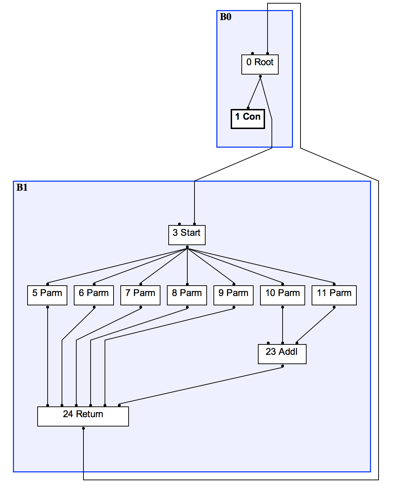

#### Output Edges (wiki) (dump)

- Node's *outgoing* edges (`def-use` edges) is an unordered collection linking the node to every other node that has input edges pointing to it.
- In the example graph above the output edges are listed in double square brackets `[[]]`.
- Typically the out edges are iterated over using the following idiom:

```cpp
for (DUIterator i = x->outs(); x->has_out(i); i++) {
  Node* y = x->out(i);
  // ...
}
```

- or (which is faster but disallows insertion to the outs array, while iterating):

```cpp
for (DUIterator_Fast imax, i = x->fast_outs(imax); i < imax; i++) {
  Node* y = x->fast_out(i);
  // ...
}
```

- Having `def-use` edges is essential to facilitate constant-time node replacement.

#### Projections (wiki) (dump)

- Result extraction from nodes producing multiple values is achieved by using projection nodes, which may be viewed as method to extract an element from the node returning a tuple.
- One of the important types of projections are *Control projections* (subclasses of the `CProjNode` node):
    - `IfTrue` and `IfFalse` that are used to split the control flow as a result of the `If` operation.

##### Example 1

```java
class X {
    private static int foo1(int a, int b) {
        return a + b;
    }
    private static int foo2(int a, int b) {
        if (a < 0) {
            return foo1(a, b);
        }
        return 0;
    }
}
```

In the following subgraph of the `foo2`, the test of `a < 0` is performed and the control flow is split using `If` and its projections:

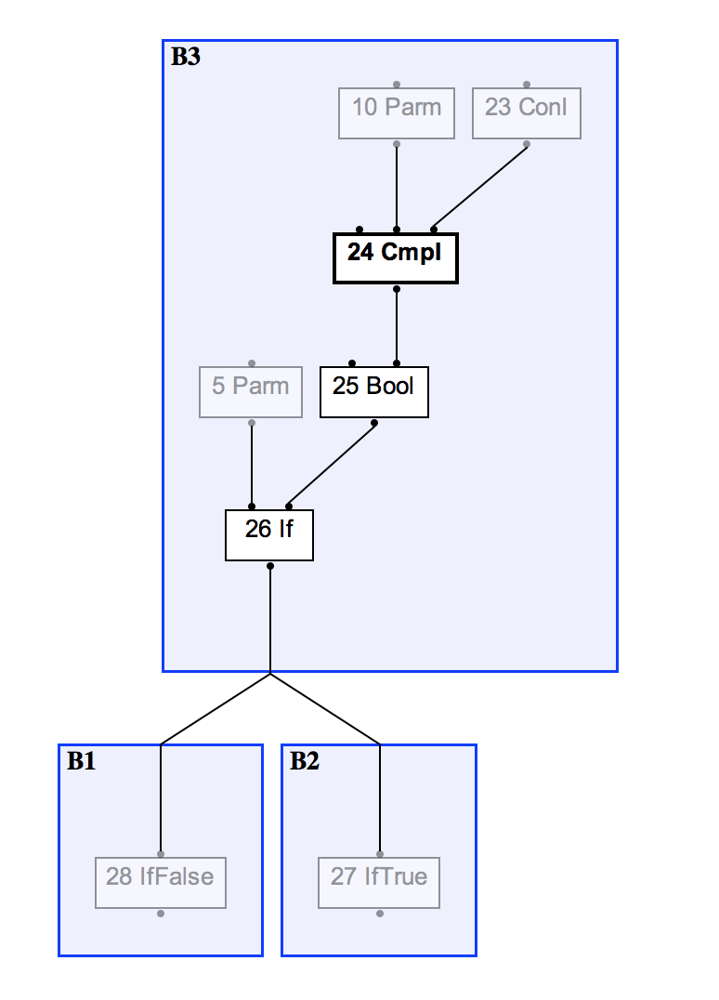

##### Example 2

- Another example of projection nodes usage is extracting side effects and return values from `Call` nodes:

```java
public class X {
    private static int foo1(int a, int b) {
        return a + b;
    }
    private static int foo2(int a, int b) {
        return foo1(a, b);
    }
}
```

- Node 28 selects the return value (an `int`), node 26 gets the memory effect, node 25 gets the i/o effect, node 24 is the exception edge.

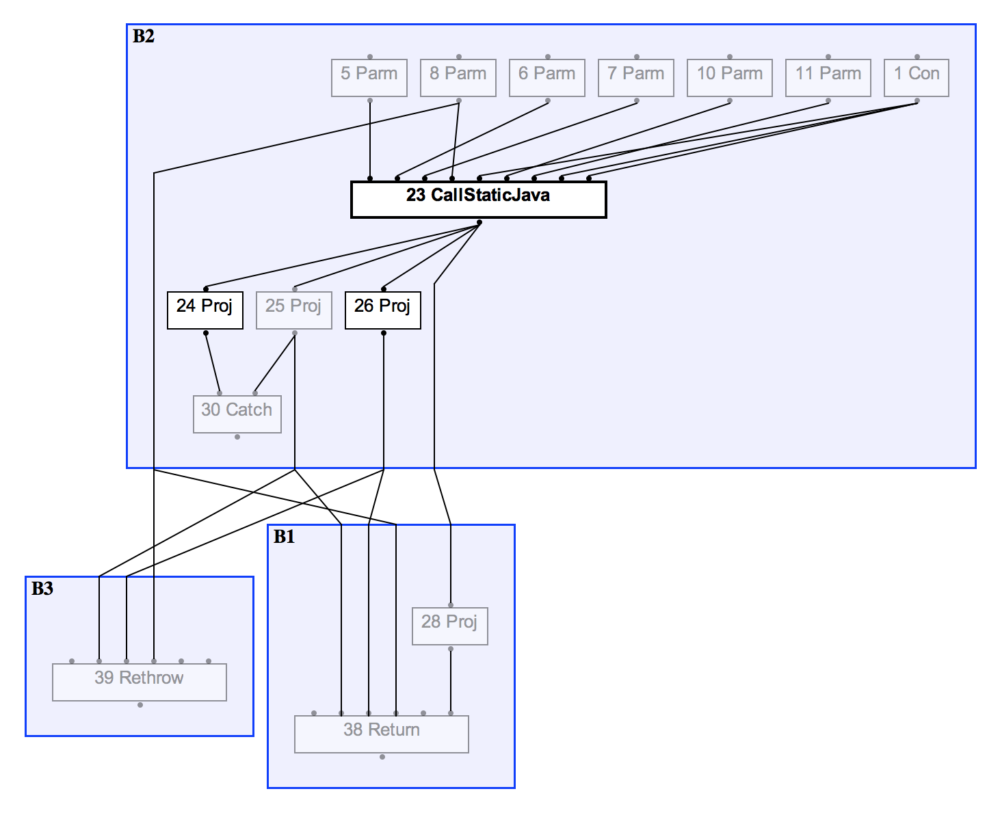

- `Catch` projections are used to select the exception handler.
- It is passed in the `bci` of the target handler (node 32, that transfers control to a rethrow), or `no_handler_bci` (node 31 in the example) in case the projection doesn't lead to an exception handler.

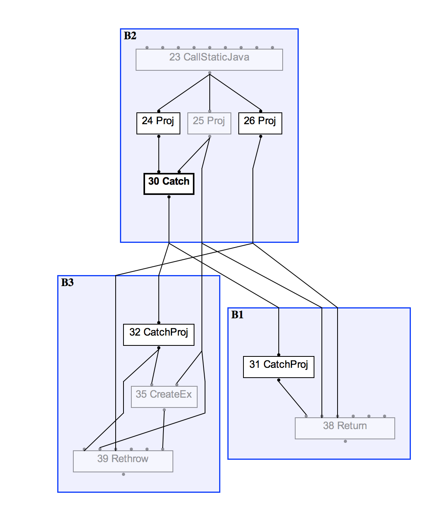

#### Region and Phi (wiki) (dump)

- There are special nodes for merging values and side-effects.
- **Region** nodes are used to merge multiple control inputs.
    - It's first input is special and is a *self-reference*, other inputs refer to the *CFG* nodes being merged.
- **Phi** nodes merge data flow and other side effects (memory and i/o) that are dependent on control flow.
    - The first input (index 0) of a *Phi* node always links it to the *Region* node.
    - Each input of a *Phi* corresponds to the input of the *Region* with the same index.
    - *Phi* takes the value of one of its inputs depending on which control edge is used to reach the *Region* node that it’s coupled with.

##### Example

```java
public class X {
    private static int foo3(int a, int b, int c) {
        if (a > b) {
            return a + c;
        } else {
            return a + b;
        }
    }
}
```

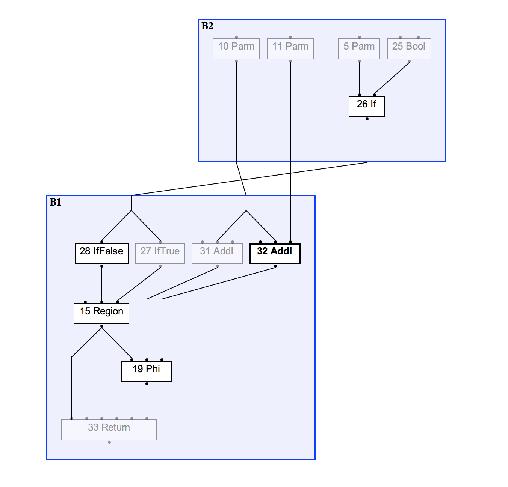

- The *Phi* (node 19) take the value returned by node 31 if control takes the `IfFalse` path, and value of node 32 if it’s the `IfTrue` path.
- *Note* that in this particular case `AddI` nodes don’t have explicit control dependencies (since they are pure), which allows them to float freely and be easily value-numbered as early as possible. Formal *IR* evaluation works independent for the traversal order: one can first evaluate the control dependency of the *Phi* and then evaluate on of the data dependencies or first evaluate the data dependencies and then choose the resulting value depending on the control input. 

#### MergeMem (wiki) (dump)

- For the purposes of *alias analysis* (and the consequent operation reordering) memory effects are spit into alias classes, *memory slices*. Each slice represents a location or a set of locations in memory.

```java
public class X {
    private int f1;
    private int f2;
    private void foo4(int a, int b) {
        f1 = a;
        f2 = b;
    }
}
```

```
29 StoreI ===  5  7  28  12  [[ 18 ]]  @X+16 *, name=f2, idx=5;  Memory: @X:NotNull+16 *, name=f2, idx=5; !jvms: X::foo4 @ bci:7
26 StoreI ===  5  7  25  11  [[ 18 ]]  @X+12 *, name=f1, idx=4;  Memory: @X:NotNull+12 *, name=f1, idx=4; !jvms: X::foo4 @ bci:2
7 Parm ===  3  [[ 18  29  26 ]] Memory  Memory: @BotPTR *+bot, idx=Bot; !jvms: X::foo4 @ bci:-1
18 MergeMem === _  1  7  1  26  29  [[ 32 ]]  { - N26:X+12 * N29:X+16 * }  Memory: @BotPTR *+bot, idx=Bot;
32 Return ===  5  6  18  8  9  [[ 0 ]]
```

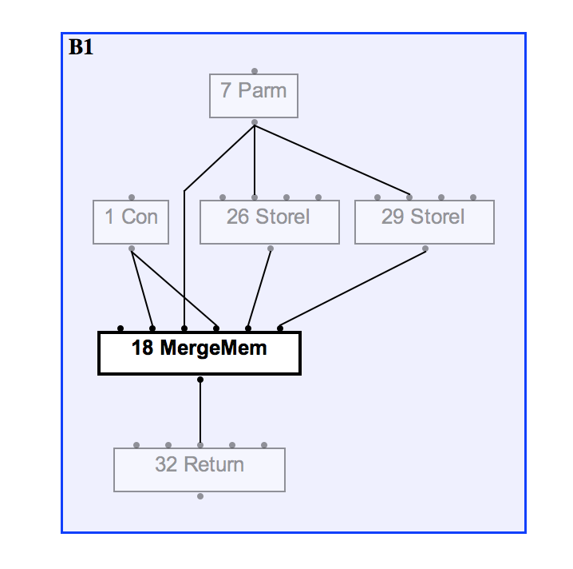

- In the example above there are two stores to the fields on an object.
- Node 7 represents the state of memory that is received by the method, it has a bottom type that means *all memory*.
- Each store (nodes 26 and 29) get this memory state as an input and each produce separate memory slices that have types `X:NotNull+12` and `X:NotNull+16` respectively.
- The memory effect of a store is essentially to cut the slice from the input memory state if necessary, modify it, and pass it to the next consumer.
- The Return node requires all memory slices as an input, and the way to express it is to make a union of all visible memory side effects at that point by using a `MergeMem` node.
- The inputs of the `MergeMem` are the effects of the two stores (that are independent) and the rest of the memory.
- There is no way to do set subtraction and represent a memory state equivalent to bottom, `{X:NotNull+12} - {X:NotNull+16}` so we just use the bottom type.

#### Methods of Node (wiki) (dump)

##### `Identity()`

- Returns an existing node which computes the same function as this node.
- The optimistic combined algorithm requires to return a Node which is a small number of steps away (e.g., one of the inputs).
- For example for `AddI`, if one of the inputs is zero, return the other input.

##### `Ideal()`

- The `Ideal` call almost arbitrarily reshapes the graph rooted at the given node.
- The reshape has to be monotonic to allow iterative convergence.
- If any change is made returns the `root` of the reshaped graph, even if the root is the same `Node`, otherwise it returns `null`.

##### Example 1

- Swapping the inputs to an `AddINode` gives the same answer and same `root`, but you still have to return the `this` pointer instead of `null`.
- It is not allowed to return an *old* `Node`, except for the `this` pointer.

##### Example 2

- `AddINode::Ideal` must check for add of zero; in this case it returns `null` instead of doing any graph reshaping.
- Ideal cannot modify any *old* `Nodes` except for the `this` pointer.
- Due to sharing there may be other users of the *old* `Nodes` relying on their current semantics.
- Modifying them will break the other users.

##### Example 3

- When reshape `(X+3)+4` into `X+7` you must leave the `Node` for `X+3` unchanged in case it is shared.

##### `Value()`

- The `Value` call is used to compute a type of the node based on the type of its inputs.

##### Example 1

- `int` types are encoded as intervals `[lo, hi]` (if `lo == h`i, that’s a constant).

##### Example 2

- In case of `AddINode::Value()` it returns an `TyepInt` with the range computed as: `[lo1,hi1] + [lo2,hi2] = if (!overflow(lo1 + lo2, hi1 + hi2)) [lo1 + lo2,hi1 + hi2] else [min_int,max_int]`. 

## Solution 2 analysis

### Intel Pin analysis

- Platform for creating analysis tools.
- It comprises *instrumentation*, *analysis* and *callback routines*.
- *Instrumentation routines:* are called when code that has not yet been recompiled is about to be run, and enable the insertion of analysis routines.
- *Analysis routines:* are called when the code associated with them is run.
- *Callback routines:* are only called when specific conditions are met, or when a certain event has occurred.
- Portable architecture by isolating platform-specific code from generic code (despite JIT compiling from one ISA to the same ISA, no single IR).
- A large array of optimization techniques are used to obtain the lowest possible running time and memory use overhead (*inlining*, *liveness analysis*, *smart register spilling*, etc.).

#### Modes

- *JIT* mode:
    - Slower but it supports all features of *Pin*.
    - It uses a *JIT compiler* to recompile all program code and insert instrumentation.
- *Probe* mode:
    - Faster (it adds almost no overhead) but it supports a limited set of features.
    - It uses *code trampolines* (jumps) for instrumentation.

#### Useful links

- [Official Pin 3.24 98612 Pin Manual](https://software.intel.com/sites/landingpage/pintool/docs/98612/Pin/doc/html/index.html).
- [Official CGO 2013 Tutorial](https://www.intel.com/content/dam/develop/external/us/en/documents/cgo2013-256675.pdf).

#### Download

- [Intel Pin Linux IA32/intel64 x86 32/64 bit](https://software.intel.com/sites/landingpage/pintool/downloads/pin-3.24-98612-g6bd5931f2-gcc-linux.tar.gz).

```bash
user@host:~ $ tax zxf pin-3.24-98612-g6bd5931f2-gcc-linux.tar.gz
user@host:~ $ cd pin-3.24-98612-g6bd5931f2-gcc-linux
user@host:~ $ mv pin-3.24-98612-g6bd5931f2-gcc-linux pin-3.24
```

#### Example (`obj-intel64/opcodemix.so`)

```bash
user@host:~/pin-3.24 $ cd source/tools/SimpleExamples
user@host:~/pin-3.24/source/tools/SimpleExamples $ make obj-intel64/opcodemix.so
user@host:~/pin-3.24/source/tools/SimpleExamples $ ../../../pin -t obj-intel64/opcodemix.so -- /bin/ls
```

### Usage with `jvbench` and `openjdk18u` (after compiling `obj-intel64/opcodemix.so`)

```bash
user@host:~/jvbench $ ../pin-3.24/pin -t ../pin-3.24/source/tools/SimpleExamples/obj-intel64/opcodemix.so -d 1 -- ../jdk18u/build/*/images/jdk/bin/java --module-path ../jdk18u/build/*/images/jmods --add-modules jdk.incubator.vector -Dsize=70000 -jar ./JVBench-1.0.jar "AxpyBenchmark"
```

- Although the `static-counts` part is not generated in this example, split the output file `opcodemix.out` into 2 parts to discard it (consider only `opcodemix-2.out`).

```bash
user@host:~/jvbench $ awk -v RS= '{print > ("opcodemix-" NR ".out")}' ./opcodemix.out
user@host:~/jvbench $ mv ./opcodemix-2.out opcodemix-dynamic.out
```

- Use the following *regex* (`pattern` file):
`MOVSS|MOVAPS|MOVUPS|MOVLPS|MOVHPS|MOVLHPS|MOVHLPS|MOVMSKPS|ADDSS|SUBSS|MULSS|DIVSS|RCPSS|SQRTSS|MAXSS|MINSS|RSQRTSS|ADDPS|SUBPS|MULPS|DIVPS|RCPPS|SQRTPS|MAXPS|MINPS|RSQRTPS|CMPSS|COMISS|UCOMISS|CMPPS|SHUFPS|UNPCKHPS|UNPCKLPS|CVTSI2SS|CVTSS2SI|CVTTSS2SI|CVTPI2PS|CVTPS2PI|CVTTPS2PI|ANDPS|ORPS|XORPS|ANDNPS|PMULHUW|PSADBW|PAVGB|PAVGW|PMAXUB|PMINUB|PMAXSW|PMINSW|PEXTRW|PINSRW|PMOVMSKB|PSHUFW|LDMXCSR|STMXCSR|MOVNTQ|MOVNTPS|MASKMOVQ|PREFETCH0|PREFETCH1|PREFETCH2|PREFETCHNTA|SFENCE`

```bash
user@host:~/jvbench $ rg -w -f patten opcodemix-dynamic.out
```

#### Output

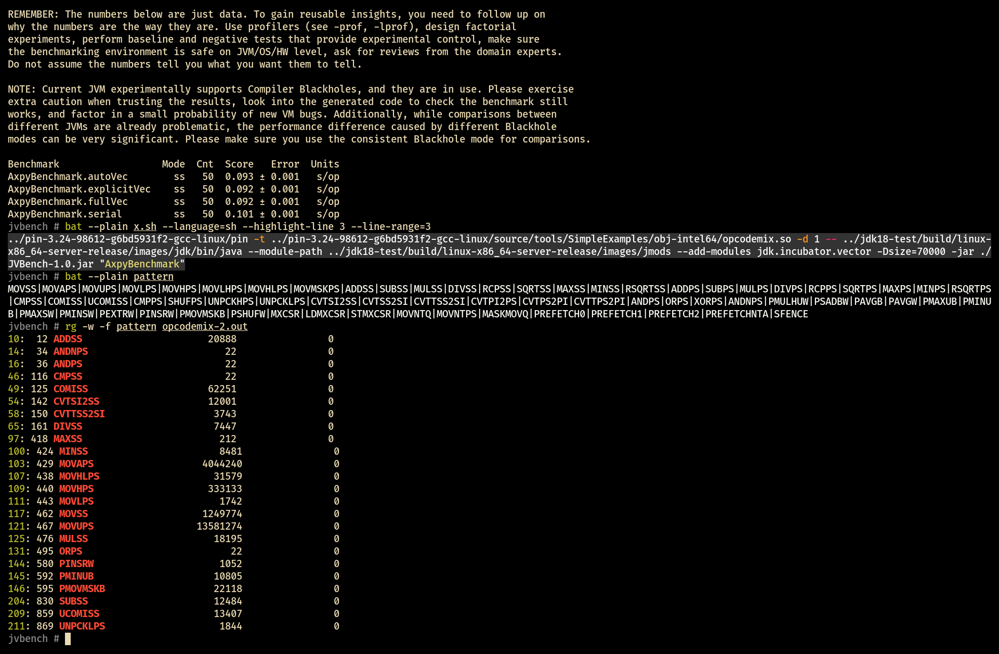

### Write a Pintool

- Required headers

```cpp
// PIN_ROOT/source/include/pin/pin.H
#include "pin.H"

// PIN_ROOT/extras/cxx/include/...
#include "fstream"
#include "iostream"
#include "unordered_map"
```

- x86 Extension Sets `enum class` definition
- From `$PIN_ROOT/extras/xed-intel64/include/xed/xed-iclass-enum.h`
- `typedef enum {...} xed_iclass_enum_t (UINT16)`

```cpp
/// Type: x86 Extension Sets
/// @note Add more sets here
enum class VXESet {
    _NONE_ = -1, ///< Not an extension
    SSE1f,       ///< SSE (Pentium 3, 1999), Floating-point
    SSE1i,       ///< SSE (Pentium 3, 1999), Integer
    SSE2f,       ///< SSE2 (Pentium 4), Floating-point
    SSE2i,       ///< SSE2 (Pentium 4), Integer
    SSE3,        ///< SSE3 (later Pentium 4)
    SSSE3,       ///< SSSE3 (early Core 2)
    SSE41,       ///< SSE4.1 (later Core 2)
    SSE4a,       ///< SSE4.a (Phenom)
    SSE42,       ///< SSE4.2 (Nehalem)
    MMX,         ///< MMX (1996)
};

// << operator overload
std::ostream &operator<<(std::ostream &o, const VXESet &t) {
    switch (t) {
    case VXESet::_NONE_: o << "---";   break;
    case VXESet::SSE1f:  o << "SSE1f"; break;
    case VXESet::SSE1i:  o << "SSE1i"; break;
    case VXESet::SSE2f:  o << "SSE2f"; break;
    case VXESet::SSE2i:  o << "SSE2i"; break;
    case VXESet::SSE3:   o << "SSE3";  break;
    case VXESet::SSSE3:  o << "SSSE3"; break;
    case VXESet::SSE41:  o << "SSE41"; break;
    case VXESet::SSE4a:  o << "SSE4a"; break;
    case VXESet::SSE42:  o << "SSE42"; break;
    case VXESet::MMX:    o << "MMX";   break;
    }
    return o;
}
```

- [Instruction: Extension Set] table definition

```cpp
/// Table: Instruction -> Extension Set
/// @note Add more entries here
const std::unordered_map<UINT16, VXESet> VXTableESet = {
    // SSE (Pentium 3, 1999), Floating-point
    { XED_ICLASS_ADDSS,      VXESet::SSE1f },
    { XED_ICLASS_ADDPS,      VXESet::SSE1f },
    { XED_ICLASS_CMPPS,      VXESet::SSE1f },
    { XED_ICLASS_CMPSS,      VXESet::SSE1f },
    { XED_ICLASS_COMISS,     VXESet::SSE1f },
    { XED_ICLASS_CVTPI2PS,   VXESet::SSE1f },
    { XED_ICLASS_CVTPS2PI,   VXESet::SSE1f },
    { XED_ICLASS_CVTSI2SS,   VXESet::SSE1f },
    { XED_ICLASS_CVTSS2SI,   VXESet::SSE1f },
    { XED_ICLASS_CVTTPS2PI,  VXESet::SSE1f },
    { XED_ICLASS_CVTTSS2SI,  VXESet::SSE1f },
    { XED_ICLASS_DIVPS,      VXESet::SSE1f },
    { XED_ICLASS_DIVSS,      VXESet::SSE1f },
    { XED_ICLASS_LDMXCSR,    VXESet::SSE1f },
    { XED_ICLASS_MAXPS,      VXESet::SSE1f },
    { XED_ICLASS_MAXSS,      VXESet::SSE1f },
    { XED_ICLASS_MINPS,      VXESet::SSE1f },
    { XED_ICLASS_MINSS,      VXESet::SSE1f },
    { XED_ICLASS_MOVAPS,     VXESet::SSE1f },
    { XED_ICLASS_MOVHLPS,    VXESet::SSE1f },
    { XED_ICLASS_MOVHPS,     VXESet::SSE1f },
    { XED_ICLASS_MOVLHPS,    VXESet::SSE1f },
    { XED_ICLASS_MOVLPS,     VXESet::SSE1f },
    { XED_ICLASS_MOVMSKPS,   VXESet::SSE1f },
    { XED_ICLASS_MOVNTPS,    VXESet::SSE1f },
    { XED_ICLASS_MOVSS,      VXESet::SSE1f },
    { XED_ICLASS_MOVUPS,     VXESet::SSE1f },
    { XED_ICLASS_MULPS,      VXESet::SSE1f },
    { XED_ICLASS_MULSS,      VXESet::SSE1f },
    { XED_ICLASS_RCPPS,      VXESet::SSE1f },
    { XED_ICLASS_RCPSS,      VXESet::SSE1f },
    { XED_ICLASS_RSQRTPS,    VXESet::SSE1f },
    { XED_ICLASS_RSQRTSS,    VXESet::SSE1f },
    { XED_ICLASS_SHUFPS,     VXESet::SSE1f },
    { XED_ICLASS_SQRTPS,     VXESet::SSE1f },
    { XED_ICLASS_SQRTSS,     VXESet::SSE1f },
    { XED_ICLASS_STMXCSR,    VXESet::SSE1f },
    { XED_ICLASS_SUBPS,      VXESet::SSE1f },
    { XED_ICLASS_SUBSS,      VXESet::SSE1f },
    { XED_ICLASS_UCOMISS,    VXESet::SSE1f },
    { XED_ICLASS_UNPCKHPS,   VXESet::SSE1f },
    { XED_ICLASS_UNPCKLPS,   VXESet::SSE1f },
    // SSE (Pentium 3, 1999), Integer
    { XED_ICLASS_ANDNPS,     VXESet::SSE1i },
    { XED_ICLASS_ANDPS,      VXESet::SSE1i },
    { XED_ICLASS_ORPS,       VXESet::SSE1i },
    { XED_ICLASS_PAVGB,      VXESet::SSE1i },
    { XED_ICLASS_PAVGW,      VXESet::SSE1i },
    { XED_ICLASS_PEXTRW,     VXESet::SSE1i },
    { XED_ICLASS_PINSRW,     VXESet::SSE1i },
    { XED_ICLASS_PMAXSW,     VXESet::SSE1i },
    { XED_ICLASS_PMAXUB,     VXESet::SSE1i },
    { XED_ICLASS_PMINSW,     VXESet::SSE1i },
    { XED_ICLASS_PMINUB,     VXESet::SSE1i },
    { XED_ICLASS_PMOVMSKB,   VXESet::SSE1i },
    { XED_ICLASS_PMULHUW,    VXESet::SSE1i },
    { XED_ICLASS_PSADBW,     VXESet::SSE1i },
    { XED_ICLASS_PSHUFW,     VXESet::SSE1i },
    { XED_ICLASS_XORPS,      VXESet::SSE1i },
    // SSE2 (Pentium 4), Floating-point
    { XED_ICLASS_ADDPD,      VXESet::SSE2f },
    { XED_ICLASS_ADDSD,      VXESet::SSE2f },
    { XED_ICLASS_ANDNPD,     VXESet::SSE2f },
    { XED_ICLASS_ANDPD,      VXESet::SSE2f },
    { XED_ICLASS_CMPPD,      VXESet::SSE2f },
    { XED_ICLASS_CMPSD,      VXESet::SSE2f },
    { XED_ICLASS_COMISD,     VXESet::SSE2f },
    { XED_ICLASS_CVTDQ2PD,   VXESet::SSE2f },
    { XED_ICLASS_CVTDQ2PS,   VXESet::SSE2f },
    { XED_ICLASS_CVTPD2DQ,   VXESet::SSE2f },
    { XED_ICLASS_CVTPD2PI,   VXESet::SSE2f },
    { XED_ICLASS_CVTPD2PS,   VXESet::SSE2f },
    { XED_ICLASS_CVTPI2PD,   VXESet::SSE2f },
    { XED_ICLASS_CVTPS2DQ,   VXESet::SSE2f },
    { XED_ICLASS_CVTPS2PD,   VXESet::SSE2f },
    { XED_ICLASS_CVTSD2SI,   VXESet::SSE2f },
    { XED_ICLASS_CVTSD2SS,   VXESet::SSE2f },
    { XED_ICLASS_CVTSI2SD,   VXESet::SSE2f },
    { XED_ICLASS_CVTSS2SD,   VXESet::SSE2f },
    { XED_ICLASS_CVTTPD2DQ,  VXESet::SSE2f },
    { XED_ICLASS_CVTTPD2PI,  VXESet::SSE2f },
    { XED_ICLASS_CVTTPS2DQ,  VXESet::SSE2f },
    { XED_ICLASS_CVTTSD2SI,  VXESet::SSE2f },
    { XED_ICLASS_DIVPD,      VXESet::SSE2f },
    { XED_ICLASS_DIVSD,      VXESet::SSE2f },
    { XED_ICLASS_MAXPD,      VXESet::SSE2f },
    { XED_ICLASS_MAXSD,      VXESet::SSE2f },
    { XED_ICLASS_MINPD,      VXESet::SSE2f },
    { XED_ICLASS_MINSD,      VXESet::SSE2f },
    { XED_ICLASS_MOVAPD,     VXESet::SSE2f },
    { XED_ICLASS_MOVHPD,     VXESet::SSE2f },
    { XED_ICLASS_MOVLPD,     VXESet::SSE2f },
    { XED_ICLASS_MOVMSKPD,   VXESet::SSE2f },
    { XED_ICLASS_MOVSD,      VXESet::SSE2f },
    { XED_ICLASS_MOVUPD,     VXESet::SSE2f },
    { XED_ICLASS_MULPD,      VXESet::SSE2f },
    { XED_ICLASS_MULSD,      VXESet::SSE2f },
    { XED_ICLASS_ORPD,       VXESet::SSE2f },
    { XED_ICLASS_SHUFPD,     VXESet::SSE2f },
    { XED_ICLASS_SQRTPD,     VXESet::SSE2f },
    { XED_ICLASS_SQRTSD,     VXESet::SSE2f },
    { XED_ICLASS_SUBPD,      VXESet::SSE2f },
    { XED_ICLASS_SUBSD,      VXESet::SSE2f },
    { XED_ICLASS_UCOMISD,    VXESet::SSE2f },
    { XED_ICLASS_UNPCKHPD,   VXESet::SSE2f },
    { XED_ICLASS_UNPCKLPD,   VXESet::SSE2f },
    { XED_ICLASS_XORPD,      VXESet::SSE2f },
    // SSE2 (Pentium 4), Integer
    { XED_ICLASS_MOVDQ2Q,    VXESet::SSE2i },
    { XED_ICLASS_MOVDQA,     VXESet::SSE2i },
    { XED_ICLASS_MOVDQU,     VXESet::SSE2i },
    { XED_ICLASS_MOVQ2DQ,    VXESet::SSE2i },
    { XED_ICLASS_PADDQ,      VXESet::SSE2i },
    { XED_ICLASS_PSUBQ,      VXESet::SSE2i },
    { XED_ICLASS_PMULUDQ,    VXESet::SSE2i },
    { XED_ICLASS_PSHUFHW,    VXESet::SSE2i },
    { XED_ICLASS_PSHUFLW,    VXESet::SSE2i },
    { XED_ICLASS_PSHUFD,     VXESet::SSE2i },
    { XED_ICLASS_PSLLDQ,     VXESet::SSE2i },
    { XED_ICLASS_PSRLDQ,     VXESet::SSE2i },
    { XED_ICLASS_PUNPCKHQDQ, VXESet::SSE2i },
    { XED_ICLASS_PUNPCKLQDQ, VXESet::SSE2i },
    // SSE3 (later Pentium 4)
    { XED_ICLASS_ADDSUBPD,   VXESet::SSE3 },
    { XED_ICLASS_ADDSUBPS,   VXESet::SSE3 },
    { XED_ICLASS_HADDPD,     VXESet::SSE3 },
    { XED_ICLASS_HADDPS,     VXESet::SSE3 },
    { XED_ICLASS_HSUBPD,     VXESet::SSE3 },
    { XED_ICLASS_HSUBPS,     VXESet::SSE3 },
    { XED_ICLASS_MOVDDUP,    VXESet::SSE3 },
    { XED_ICLASS_MOVSHDUP,   VXESet::SSE3 },
    { XED_ICLASS_MOVSLDUP,   VXESet::SSE3 },
    // SSSE3 (early Core 2)
    { XED_ICLASS_PSIGNW,     VXESet::SSSE3 },
    { XED_ICLASS_PSIGND,     VXESet::SSSE3 },
    { XED_ICLASS_PSIGNB,     VXESet::SSSE3 },
    { XED_ICLASS_PSHUFB,     VXESet::SSSE3 },
    { XED_ICLASS_PMULHRSW,   VXESet::SSSE3 },
    { XED_ICLASS_PMADDUBSW,  VXESet::SSSE3 },
    { XED_ICLASS_PHSUBW,     VXESet::SSSE3 },
    { XED_ICLASS_PHSUBSW,    VXESet::SSSE3 },
    { XED_ICLASS_PHSUBD,     VXESet::SSSE3 },
    { XED_ICLASS_PHADDW,     VXESet::SSSE3 },
    { XED_ICLASS_PHADDSW,    VXESet::SSSE3 },
    { XED_ICLASS_PHADDD,     VXESet::SSSE3 },
    { XED_ICLASS_PALIGNR,    VXESet::SSSE3 },
    { XED_ICLASS_PABSW,      VXESet::SSSE3 },
    { XED_ICLASS_PABSD,      VXESet::SSSE3 },
    { XED_ICLASS_PABSB,      VXESet::SSSE3 },
    // SSE4.1 (later Core 2)
    { XED_ICLASS_MPSADBW,    VXESet::SSE41 },
    { XED_ICLASS_PHMINPOSUW, VXESet::SSE41 },
    { XED_ICLASS_PMULLD,     VXESet::SSE41 },
    { XED_ICLASS_PMULDQ,     VXESet::SSE41 },
    { XED_ICLASS_DPPS,       VXESet::SSE41 },
    { XED_ICLASS_DPPD,       VXESet::SSE41 },
    { XED_ICLASS_BLENDPS,    VXESet::SSE41 },
    { XED_ICLASS_BLENDPD,    VXESet::SSE41 },
    { XED_ICLASS_BLENDVPS,   VXESet::SSE41 },
    { XED_ICLASS_BLENDVPD,   VXESet::SSE41 },
    { XED_ICLASS_PBLENDVB,   VXESet::SSE41 },
    { XED_ICLASS_PBLENDW,    VXESet::SSE41 },
    { XED_ICLASS_PMINSB,     VXESet::SSE41 },
    { XED_ICLASS_PMAXSB,     VXESet::SSE41 },
    { XED_ICLASS_PMINUW,     VXESet::SSE41 },
    { XED_ICLASS_PMAXUW,     VXESet::SSE41 },
    { XED_ICLASS_PMINUD,     VXESet::SSE41 },
    { XED_ICLASS_PMAXUD,     VXESet::SSE41 },
    { XED_ICLASS_PMINSD,     VXESet::SSE41 },
    { XED_ICLASS_PMAXSD,     VXESet::SSE41 },
    { XED_ICLASS_ROUNDPS,    VXESet::SSE41 },
    { XED_ICLASS_ROUNDSS,    VXESet::SSE41 },
    { XED_ICLASS_ROUNDPD,    VXESet::SSE41 },
    { XED_ICLASS_ROUNDSD,    VXESet::SSE41 },
    { XED_ICLASS_INSERTPS,   VXESet::SSE41 },
    { XED_ICLASS_PINSRB,     VXESet::SSE41 },
    { XED_ICLASS_PINSRD,     VXESet::SSE41 },
    { XED_ICLASS_PINSRQ,     VXESet::SSE41 },
    { XED_ICLASS_EXTRACTPS,  VXESet::SSE41 },
    { XED_ICLASS_PEXTRB,     VXESet::SSE41 },
    { XED_ICLASS_PEXTRW,     VXESet::SSE41 },
    { XED_ICLASS_PEXTRD,     VXESet::SSE41 },
    { XED_ICLASS_PEXTRQ,     VXESet::SSE41 },
    { XED_ICLASS_PMOVSXBW,   VXESet::SSE41 },
    { XED_ICLASS_PMOVZXBW,   VXESet::SSE41 },
    { XED_ICLASS_PMOVSXBD,   VXESet::SSE41 },
    { XED_ICLASS_PMOVZXBD,   VXESet::SSE41 },
    { XED_ICLASS_PMOVSXBQ,   VXESet::SSE41 },
    { XED_ICLASS_PMOVZXBQ,   VXESet::SSE41 },
    { XED_ICLASS_PMOVSXWD,   VXESet::SSE41 },
    { XED_ICLASS_PMOVZXWD,   VXESet::SSE41 },
    { XED_ICLASS_PMOVSXWQ,   VXESet::SSE41 },
    { XED_ICLASS_PMOVZXWQ,   VXESet::SSE41 },
    { XED_ICLASS_PMOVSXDQ,   VXESet::SSE41 },
    { XED_ICLASS_PMOVZXDQ,   VXESet::SSE41 },
    { XED_ICLASS_PTEST,      VXESet::SSE41 },
    { XED_ICLASS_PCMPEQQ,    VXESet::SSE41 },
    { XED_ICLASS_PACKUSDW,   VXESet::SSE41 },
    { XED_ICLASS_MOVNTDQA,   VXESet::SSE41 },
    // SSE4.a (Phenom)
    { XED_ICLASS_LZCNT,      VXESet::SSE4a },
    { XED_ICLASS_POPCNT,     VXESet::SSE4a },
    { XED_ICLASS_EXTRQ,      VXESet::SSE4a },
    { XED_ICLASS_INSERTQ,    VXESet::SSE4a },
    { XED_ICLASS_MOVNTSD,    VXESet::SSE4a },
    { XED_ICLASS_MOVNTSS,    VXESet::SSE4a },
    // SSE4.2 (Nehalem)
    { XED_ICLASS_CRC32,      VXESet::SSE42 },
    { XED_ICLASS_PCMPESTRI,  VXESet::SSE42 },
    { XED_ICLASS_PCMPESTRM,  VXESet::SSE42 },
    { XED_ICLASS_PCMPISTRI,  VXESet::SSE42 },
    { XED_ICLASS_PCMPISTRM,  VXESet::SSE42 },
    { XED_ICLASS_PCMPGTQ,    VXESet::SSE42 },
    // MMX (1996)
    { XED_ICLASS_EMMS,       VXESet::MMX },
    { XED_ICLASS_MOVD,       VXESet::MMX },
    { XED_ICLASS_MOVQ,       VXESet::MMX },
    { XED_ICLASS_PACKSSDW,   VXESet::MMX },
    { XED_ICLASS_PACKSSWB,   VXESet::MMX },
    { XED_ICLASS_PACKUSWB,   VXESet::MMX },
    { XED_ICLASS_PADDB,      VXESet::MMX },
    { XED_ICLASS_PADDD,      VXESet::MMX },
    { XED_ICLASS_PADDSB,     VXESet::MMX },
    { XED_ICLASS_PADDSW,     VXESet::MMX },
    { XED_ICLASS_PADDUSB,    VXESet::MMX },
    { XED_ICLASS_PADDUSW,    VXESet::MMX },
    { XED_ICLASS_PADDW,      VXESet::MMX },
    { XED_ICLASS_PAND,       VXESet::MMX },
    { XED_ICLASS_PANDN,      VXESet::MMX },
    { XED_ICLASS_PCMPEQB,    VXESet::MMX },
    { XED_ICLASS_PCMPEQD,    VXESet::MMX },
    { XED_ICLASS_PCMPEQW,    VXESet::MMX },
    { XED_ICLASS_PCMPGTB,    VXESet::MMX },
    { XED_ICLASS_PCMPGTD,    VXESet::MMX },
    { XED_ICLASS_PCMPGTW,    VXESet::MMX },
    { XED_ICLASS_PMADDWD,    VXESet::MMX },
    { XED_ICLASS_PMULHW,     VXESet::MMX },
    { XED_ICLASS_PMULLW,     VXESet::MMX },
    { XED_ICLASS_POR,        VXESet::MMX },
    { XED_ICLASS_PSLLD,      VXESet::MMX },
    { XED_ICLASS_PSLLQ,      VXESet::MMX },
    { XED_ICLASS_PSLLW,      VXESet::MMX },
    { XED_ICLASS_PSRAD,      VXESet::MMX },
    { XED_ICLASS_PSRAW,      VXESet::MMX },
    { XED_ICLASS_PSRLD,      VXESet::MMX },
    { XED_ICLASS_PSRLQ,      VXESet::MMX },
    { XED_ICLASS_PSRLW,      VXESet::MMX },
    { XED_ICLASS_PSUBB,      VXESet::MMX },
    { XED_ICLASS_PSUBD,      VXESet::MMX },
    { XED_ICLASS_PSUBSB,     VXESet::MMX },
    { XED_ICLASS_PSUBSW,     VXESet::MMX },
    { XED_ICLASS_PSUBUSB,    VXESet::MMX },
    { XED_ICLASS_PSUBUSW,    VXESet::MMX },
    { XED_ICLASS_PSUBW,      VXESet::MMX },
    { XED_ICLASS_PUNPCKHBW,  VXESet::MMX },
    { XED_ICLASS_PUNPCKHDQ,  VXESet::MMX },
    { XED_ICLASS_PUNPCKHWD,  VXESet::MMX },
    { XED_ICLASS_PUNPCKLBW,  VXESet::MMX },
    { XED_ICLASS_PUNPCKLDQ,  VXESet::MMX },
    { XED_ICLASS_PUNPCKLWD,  VXESet::MMX },
    { XED_ICLASS_PXOR,       VXESet::MMX },
};
```

- Function `getVXESet` definition

```cpp
/// Get the Extension Set to which the current instruction belongs
/// @param o current instruction opcode
VXESet getVXESet(OPCODE opcode) {
    auto vxeset = VXTableESet.find(opcode);
    if (vxeset != VXTableESet.end())
        return vxeset->second;
    return VXESet::_NONE_;
}
```

- [Instruction: Description] table definition

```cpp
/// Table: Instruction -> Description
/// @note Add more entries here
const std::unordered_map<UINT16, std::string> VXTableDesc = {
    // SSE (Pentium 3, 1999), Floating-Point
    { XED_ICLASS_ADDSS,      "Add Scalar Single-Precision Floating-Point Values" },
    { XED_ICLASS_ADDPS,      "Add Packed Single-Precision Floating-Point Values" },
    { XED_ICLASS_CMPPS,      "Compare Packed Single-Precision Floating-Point Values" },
    { XED_ICLASS_CMPSS,      "Compare Scalar Single-Precision Floating-Point Value" },
    { XED_ICLASS_COMISS,     "Compare Scalar Ordered Single-Precision Floating-Point Values and Set EFLAGS" },
    { XED_ICLASS_CVTPI2PS,   "Convert Packed Dword Integers to Packed Single-Precision FP Values" },
    { XED_ICLASS_CVTPS2PI,   "Convert Packed Single-Precision FP Values to Packed Dword Integers" },
    { XED_ICLASS_CVTSI2SS,   "Convert Doubleword Integer to Scalar Single-Precision Floating-Point Value" },
    { XED_ICLASS_CVTSS2SI,   "Convert Scalar Single-Precision Floating-Point Value to Doubleword Integer" },
    { XED_ICLASS_CVTTPS2PI,  "Convert with Truncation Packed Single-Precision FP Values to Packed Dword Integers" },
    { XED_ICLASS_CVTTSS2SI,  "Convert with Truncation Scalar Single-Precision Floating-Point Value to Integer" },
    { XED_ICLASS_DIVPS,      "Divide Packed Single-Precision Floating-Point Values" },
    { XED_ICLASS_DIVSS,      "Divide Scalar Single-Precision Floating-Point Values" },
    { XED_ICLASS_LDMXCSR,    "Load MXCSR Register" },
    { XED_ICLASS_MAXPS,      "Maximum of Packed Single-Precision Floating-Point Values" },
    { XED_ICLASS_MAXSS,      "Return Maximum Scalar Single-Precision Floating-Point Value" },
    { XED_ICLASS_MINPS,      "Minimum of Packed Single-Precision Floating-Point Values" },
    { XED_ICLASS_MINSS,      "Return Minimum Scalar Single-Precision Floating-Point Value" },
    { XED_ICLASS_MOVAPS,     "Move Aligned Packed Single-Precision Floating-Point Values" },
    { XED_ICLASS_MOVHLPS,    "Move Packed Single-Precision Floating-Point Values High to Low" },
    { XED_ICLASS_MOVHPS,     "Move High Packed Single-Precision Floating-Point Values" },
    { XED_ICLASS_MOVLHPS,    "Move Packed Single-Precision Floating-Point Values Low to High" },
    { XED_ICLASS_MOVLPS,     "Move Low Packed Single-Precision Floating-Point Values" },
    { XED_ICLASS_MOVMSKPS,   "Extract Packed Single-Precision Floating-Point Sign Mask" },
    { XED_ICLASS_MOVNTPS,    "Store Packed Single-Precision Floating-Point Values Using Non-Temporal Hint" },
    { XED_ICLASS_MOVSS,      "Move or Merge Scalar Single-Precision Floating-Point Value" },
    { XED_ICLASS_MOVUPS,     "Move Unaligned Packed Single-Precision Floating-Point Values" },
    { XED_ICLASS_MULPS,      "Multiply Packed Single-Precision Floating-Point Values" },
    { XED_ICLASS_MULSS,      "Multiply Scalar Single-Precision Floating-Point Values" },
    { XED_ICLASS_RCPPS,      "Compute Reciprocals of Packed Single-Precision Floating-Point Values" },
    { XED_ICLASS_RCPSS,      "Compute Reciprocal of Scalar Single-Precision Floating-Point Values" },
    { XED_ICLASS_RSQRTPS,    "Compute Reciprocals of Square Roots of Packed Single-Precision Floating-Point Values" },
    { XED_ICLASS_RSQRTSS,    "Compute Reciprocal of Square Root of Scalar Single-Precision Floating-Point Value" },
    { XED_ICLASS_SHUFPS,     "Packed Interleave Shuffle of Quadruplets of Single-Precision Floating-Point Values" },
    { XED_ICLASS_SQRTPS,     "Square Root of Single-Precision Floating-Point Values" },
    { XED_ICLASS_SQRTSS,     "Compute Square Root of Scalar Single-Precision Value" },
    { XED_ICLASS_STMXCSR,    "Store MXCSR Register State" },
    { XED_ICLASS_SUBPS,      "Subtract Packed Single-Precision Floating-Point Values" },
    { XED_ICLASS_SUBSS,      "Subtract Scalar Single-Precision Floating-Point Value" },
    { XED_ICLASS_UCOMISS,    "Unordered Compare Scalar Single-Precision Floating-Point Values and Set EFLAGS" },
    { XED_ICLASS_UNPCKHPS,   "Unpack and Interleave High Packed Single-Precision Floating-Point Values" },
    { XED_ICLASS_UNPCKLPS,   "Unpack and Interleave Low Packed Single-Precision Floating-Point Values" },
    // SSE (Pentium 3, 1999), Integer
    { XED_ICLASS_ANDNPS,     "Bitwise Logical AND NOT of Packed Single Precision Floating-Point Values" },
    { XED_ICLASS_ANDPS,      "Bitwise Logical AND of Packed Single Precision Floating-Point Values" },
    { XED_ICLASS_ORPS,       "Bitwise Logical OR of Packed Single Precision Floating-Point Values" },
    { XED_ICLASS_PAVGB,      "Average Packed Integers" },
    { XED_ICLASS_PAVGW,      "Average Packed Integers" },
    { XED_ICLASS_PEXTRW,     "Extract Word" },
    { XED_ICLASS_PINSRW,     "Insert Word" },
    { XED_ICLASS_PMAXSW,     "Maximum of Packed Signed Integers" },
    { XED_ICLASS_PMAXUB,     "Maximum of Packed Unsigned Integers" },
    { XED_ICLASS_PMINSW,     "Minimum of Packed Signed Integers" },
    { XED_ICLASS_PMINUB,     "Minimum of Packed Unsigned Integers" },
    { XED_ICLASS_PMOVMSKB,   "Move Byte Mask" },
    { XED_ICLASS_PMULHUW,    "Multiply Packed Unsigned Integers and Store High Result" },
    { XED_ICLASS_PSADBW,     "Compute Sum of Absolute Differences" },
    { XED_ICLASS_PSHUFW,     "Shuffle Packed Words" },
    { XED_ICLASS_XORPS,      "Bitwise Logical XOR of Packed Single Precision Floating-Point Values" },
    // SSE2 (Pentium 4), Floating-point
    { XED_ICLASS_ADDPD,      "Add Packed Double-Precision Floating-Point Values" },
    { XED_ICLASS_ADDSD,      "Add Scalar Double-Precision Floating-Point Values" },
    { XED_ICLASS_ANDNPD,     "Bitwise Logical AND NOT of Packed Double Precision Floating-Point Values" },
    { XED_ICLASS_ANDPD,      "Bitwise Logical AND of Packed Double Precision Floating-Point Values" },
    { XED_ICLASS_CMPPD,      "Compare Packed Double-Precision Floating-Point Values" },
    { XED_ICLASS_CMPSD,      "Compare Scalar Double-Precision Floating-Point Value" },
    { XED_ICLASS_COMISD,     "Compare Scalar Ordered Double-Precision Floating-Point Values and Set EFLAGS" },
    { XED_ICLASS_CVTDQ2PD,   "Convert Packed Doubleword Integers to Packed Double-Precision Floating-Point Values" },
    { XED_ICLASS_CVTDQ2PS,   "Convert Packed Doubleword Integers to Packed Single-Precision Floating-Point Values" },
    { XED_ICLASS_CVTPD2DQ,   "Convert Packed Double-Precision Floating-Point Values to Packed Doubleword Integers" },
    { XED_ICLASS_CVTPD2PI,   "Convert Packed Double-Precision FP Values to Packed Dword Integers" },
    { XED_ICLASS_CVTPD2PS,   "Convert Packed Double-Precision Floating-Point Values to Packed Single-Precision Floating-Point Values" },
    { XED_ICLASS_CVTPI2PD,   "Convert Packed Dword Integers to Packed Double-Precision FP Values" },
    { XED_ICLASS_CVTPS2DQ,   "Convert Packed Single-Precision Floating-Point Values to Packed Signed Doubleword Integer Values" },
    { XED_ICLASS_CVTPS2PD,   "Convert Packed Single-Precision Floating-Point Values to Packed Double-Precision Floating-Point Values" },
    { XED_ICLASS_CVTSD2SI,   "Convert Scalar Double-Precision Floating-Point Value to Doubleword Integer" },
    { XED_ICLASS_CVTSD2SS,   "Convert Scalar Double-Precision Floating-Point Value to Scalar Single-Precision Floating-Point Value" },
    { XED_ICLASS_CVTSI2SD,   "Convert Doubleword Integer to Scalar Double-Precision Floating-Point Value" },
    { XED_ICLASS_CVTSS2SD,   "Convert Scalar Single-Precision Floating-Point Value to Scalar Double-Precision Floating-Point Value" },
    { XED_ICLASS_CVTTPD2DQ,  "Convert with Truncation Packed Double-Precision Floating-Point Values to Packed Doubleword Integers" },
    { XED_ICLASS_CVTTPD2PI,  "Convert with Truncation Packed Double-Precision FP Values to Packed Dword Integers" },
    { XED_ICLASS_CVTTPS2DQ,  "Convert with Truncation Packed Single-Precision Floating-Point Values to Packed Signed Doubleword Integer Values" },
    { XED_ICLASS_CVTTSD2SI,  "Convert with Truncation Scalar Double-Precision Floating-Point Value to Signed Integer" },
    { XED_ICLASS_DIVPD,      "Divide Packed Double-Precision Floating-Point Values" },
    { XED_ICLASS_DIVSD,      "Divide Scalar Double-Precision Floating-Point Value" },
    { XED_ICLASS_MAXPD,      "Maximum of Packed Double-Precision Floating-Point Values" },
    { XED_ICLASS_MAXSD,      "Return Maximum Scalar Double-Precision Floating-Point Value" },
    { XED_ICLASS_MINPD,      "Minimum of Packed Double-Precision Floating-Point Values" },
    { XED_ICLASS_MINSD,      "Return Minimum Scalar Double-Precision Floating-Point Value" },
    { XED_ICLASS_MOVAPD,     "Move Aligned Packed Double-Precision Floating-Point Values" },
    { XED_ICLASS_MOVHPD,     "Move High Packed Double-Precision Floating-Point Value" },
    { XED_ICLASS_MOVLPD,     "Move Low Packed Double-Precision Floating-Point Value" },
    { XED_ICLASS_MOVMSKPD,   "Extract Packed Double-Precision Floating-Point Sign Mask" },
    { XED_ICLASS_MOVSD,      "Move or Merge Scalar Double-Precision Floating-Point Value" },
    { XED_ICLASS_MOVUPD,     "Move Unaligned Packed Double-Precision Floating-Point Values" },
    { XED_ICLASS_MULPD,      "Multiply Packed Double-Precision Floating-Point Values" },
    { XED_ICLASS_MULSD,      "Multiply Scalar Double-Precision Floating-Point Value" },
    { XED_ICLASS_ORPD,       "Bitwise Logical OR of Packed Double Precision Floating-Point Values" },
    { XED_ICLASS_SHUFPD,     "Packed Interleave Shuffle of Pairs of Double-Precision Floating-Point Values" },
    { XED_ICLASS_SQRTPD,     "Square Root of Double-Precision Floating-Point Values" },
    { XED_ICLASS_SQRTSD,     "Compute Square Root of Scalar Double-Precision Floating-Point Value" },
    { XED_ICLASS_SUBPD,      "Subtract Packed Double-Precision Floating-Point Values" },
    { XED_ICLASS_SUBSD,      "Subtract Scalar Double-Precision Floating-Point Value" },
    { XED_ICLASS_UCOMISD,    "Unordered Compare Scalar Double-Precision Floating-Point Values and Set EFLAGS" },
    { XED_ICLASS_UNPCKHPD,   "Unpack and Interleave High Packed Double-Precision Floating-Point Values" },
    { XED_ICLASS_UNPCKLPD,   "Unpack and Interleave Low Packed Double-Precision Floating-Point Values" },
    { XED_ICLASS_XORPD,      "Bitwise Logical XOR of Packed Double Precision Floating-Point Values" },
    // SSE2 (Pentium 4), Integer
    { XED_ICLASS_MOVDQ2Q,    "Move Quadword from XMM to MMX Technology Register" },
    { XED_ICLASS_MOVDQA,     "Move Aligned Packed Integer Values" },
    { XED_ICLASS_MOVDQU,     "Move Unaligned Packed Integer Values" },
    { XED_ICLASS_MOVQ2DQ,    "Move Quadword from MMX Technology to XMM Register" },
    { XED_ICLASS_PADDQ,      "Add Packed Integers" },
    { XED_ICLASS_PSUBQ,      "Subtract Packed Quadword Integers" },
    { XED_ICLASS_PMULUDQ,    "Multiply Packed Unsigned Doubleword Integers" },
    { XED_ICLASS_PSHUFHW,    "Shuffle Packed High Words" },
    { XED_ICLASS_PSHUFLW,    "Shuffle Packed Low Words" },
    { XED_ICLASS_PSHUFD,     "Shuffle Packed Doublewords" },
    { XED_ICLASS_PSLLDQ,     "Shift Double Quadword Left Logical" },
    { XED_ICLASS_PSRLDQ,     "Shift Double Quadword Right Logical" },
    { XED_ICLASS_PUNPCKHQDQ, "Unpack High Data" },
    { XED_ICLASS_PUNPCKLQDQ, "Unpack Low Data" },
    // SSE3 (later Pentium 4)
    { XED_ICLASS_ADDSUBPD,   "Packed Double-FP Add/Subtract" },
    { XED_ICLASS_ADDSUBPS,   "Packed Single-FP Add/Subtract" },
    { XED_ICLASS_HADDPD,     "Packed Double-FP Horizontal Add" },
    { XED_ICLASS_HADDPS,     "Packed Single-FP Horizontal Add" },
    { XED_ICLASS_HSUBPD,     "Packed Double-FP Horizontal Subtract" },
    { XED_ICLASS_HSUBPS,     "Packed Single-FP Horizontal Subtract" },
    { XED_ICLASS_MOVDDUP,    "Replicate Double FP Values" },
    { XED_ICLASS_MOVSHDUP,   "Replicate Single FP Values" },
    { XED_ICLASS_MOVSLDUP,   "Replicate Single FP Values" },
    // SSSE3 (early Core 2)
    { XED_ICLASS_PSIGNW,     "Packed SIGN" },
    { XED_ICLASS_PSIGND,     "Packed SIGN" },
    { XED_ICLASS_PSIGNB,     "Packed SIGN" },
    { XED_ICLASS_PSHUFB,     "Packed Shuffle Bytes" },
    { XED_ICLASS_PMULHRSW,   "Packed Multiply High with Round and Scale" },
    { XED_ICLASS_PMADDUBSW,  "Multiply and Add Packed Signed and Unsigned Bytes" },
    { XED_ICLASS_PHSUBW,     "Packed Horizontal Subtract" },
    { XED_ICLASS_PHSUBSW,    "Packed Horizontal Subtract and Saturate" },
    { XED_ICLASS_PHSUBD,     "Packed Horizontal Subtract" },
    { XED_ICLASS_PHADDW,     "Packed Horizontal Add" },
    { XED_ICLASS_PHADDSW,    "Packed Horizontal Add and Saturate" },
    { XED_ICLASS_PHADDD,     "Packed Horizontal Add" },
    { XED_ICLASS_PALIGNR,    "Packed Align Right" },
    { XED_ICLASS_PABSW,      "Packed Absolute Value" },
    { XED_ICLASS_PABSD,      "Packed Absolute Value" },
    { XED_ICLASS_PABSB,      "Packed Absolute Value" },
    // SSE4.1 (later Core 2)
    { XED_ICLASS_MPSADBW,    "Compute Multiple Packed Sums of Absolute Difference" },
    { XED_ICLASS_PHMINPOSUW, "Packed Horizontal Word Minimum" },
    { XED_ICLASS_PMULLD,     "Multiply Packed Integers and Store Low Result" },
    { XED_ICLASS_PMULDQ,     "Multiply Packed Doubleword Integers" },
    { XED_ICLASS_DPPS,       "Dot Product of Packed Single Precision Floating-Point Values" },
    { XED_ICLASS_DPPD,       "Dot Product of Packed Double Precision Floating-Point Values" },
    { XED_ICLASS_BLENDPS,    "Blend Packed Single Precision Floating-Point Values" },
    { XED_ICLASS_BLENDPD,    "Blend Packed Double Precision Floating-Point Values" },
    { XED_ICLASS_BLENDVPS,   "Variable Blend Packed Single Precision Floating-Point Values" },
    { XED_ICLASS_BLENDVPD,   "Variable Blend Packed Double Precision Floating-Point Values" },
    { XED_ICLASS_PBLENDVB,   "Variable Blend Packed Bytes" },
    { XED_ICLASS_PBLENDW,    "Blend Packed Words" },
    { XED_ICLASS_PMINSB,     "Minimum of Packed Signed Integers" },
    { XED_ICLASS_PMAXSB,     "Maximum of Packed Signed Integers" },
    { XED_ICLASS_PMINUW,     "Minimum of Packed Unsigned Integers" },
    { XED_ICLASS_PMAXUW,     "Maximum of Packed Unsigned Integers" },
    { XED_ICLASS_PMINUD,     "Minimum of Packed Unsigned Integers" },
    { XED_ICLASS_PMAXUD,     "Maximum of Packed Unsigned Integers" },
    { XED_ICLASS_PMINSD,     "Minimum of Packed Signed Integers" },
    { XED_ICLASS_PMAXSD,     "Maximum of Packed Signed Integers" },
    { XED_ICLASS_ROUNDPS,    "Round Packed Single Precision Floating-Point Values" },
    { XED_ICLASS_ROUNDSS,    "Round Scalar Single Precision Floating-Point Values" },
    { XED_ICLASS_ROUNDPD,    "Round Packed Double Precision Floating-Point Values" },
    { XED_ICLASS_ROUNDSD,    "Round Scalar Double Precision Floating-Point Values" },
    { XED_ICLASS_INSERTPS,   "Insert Scalar Single-Precision Floating-Point Value" },
    { XED_ICLASS_PINSRB,     "Insert Byte/Dword/Qword" },
    { XED_ICLASS_PINSRD,     "Insert Byte/Dword/Qword" },
    { XED_ICLASS_PINSRQ,     "Insert Byte/Dword/Qword" },
    { XED_ICLASS_EXTRACTPS,  "Extract Packed Floating-Point Values" },
    { XED_ICLASS_PEXTRB,     "Extract Byte/Dword/Qword" },
    { XED_ICLASS_PEXTRW,     "Extract Word" },
    { XED_ICLASS_PEXTRD,     "Extract Byte/Dword/Qword" },
    { XED_ICLASS_PEXTRQ,     "Extract Byte/Dword/Qword" },
    { XED_ICLASS_PMOVSXBW,   "Packed Move with Sign Extend" },
    { XED_ICLASS_PMOVZXBW,   "Packed Move with Zero Extend" },
    { XED_ICLASS_PMOVSXBD,   "Packed Move with Sign Extend" },
    { XED_ICLASS_PMOVZXBD,   "Packed Move with Zero Extend" },
    { XED_ICLASS_PMOVSXBQ,   "Packed Move with Sign Extend" },
    { XED_ICLASS_PMOVZXBQ,   "Packed Move with Zero Extend" },
    { XED_ICLASS_PMOVSXWD,   "Packed Move with Zero ExtendPacked Move with Sign Extend" },
    { XED_ICLASS_PMOVZXWD,   "Packed Move with Zero Extend" },
    { XED_ICLASS_PMOVSXWQ,   "Packed Move with Sign Extend" },
    { XED_ICLASS_PMOVZXWQ,   "Packed Move with Zero Extend" },
    { XED_ICLASS_PMOVSXDQ,   "Packed Move with Sign Extend" },
    { XED_ICLASS_PMOVZXDQ,   "Packed Move with Zero Extend" },
    { XED_ICLASS_PTEST,      "Logical Compare" },
    { XED_ICLASS_PCMPEQQ,    "Compare Packed Qword Data for Equal" },
    { XED_ICLASS_PACKUSDW,   "Pack with Unsigned Saturation" },
    { XED_ICLASS_MOVNTDQA,   "Load Double Quadword Non-Temporal Aligned Hint" },
    // SSE4.a (Phenom)
    { XED_ICLASS_LZCNT,      "Count the Number of Leading Zero Bits" },
    { XED_ICLASS_POPCNT,     "Return the Count of Number of Bits Set to 1" },
    { XED_ICLASS_EXTRQ,      "Extract Byte/Dword/Qword" },
    { XED_ICLASS_INSERTQ,    "Insert Field" },
    { XED_ICLASS_MOVNTSD,    "Move Non-Temporal Scalar Double-Precision Floating-point" },
    { XED_ICLASS_MOVNTSS,    "Move Non-Temporal Scalar Single-Precision Floating-point" },
    // SSE4.2 (Nehalem)
    { XED_ICLASS_CRC32,      "Accumulate CRC32 Value" },
    { XED_ICLASS_PCMPESTRI,  "Packed Compare Explicit Length Strings and Return Index" },
    { XED_ICLASS_PCMPESTRM,  "Packed Compare Explicit Length Strings and Return Mask" },
    { XED_ICLASS_PCMPISTRI,  "Packed Compare Implicit Length Strings and Return Index" },
    { XED_ICLASS_PCMPISTRM,  "Packed Compare Implicit Length Strings and Return Mask" },
    { XED_ICLASS_PCMPGTQ,    "Compare Packed Data for Greater Than" },
    // MMX (1996)
    { XED_ICLASS_EMMS,       "Empty MMX Technology State" },
    { XED_ICLASS_MOVD,       "Move Doubleword/Move Quadword" },
    { XED_ICLASS_MOVQ,       "Move Doubleword/Move Quadword" },
    { XED_ICLASS_PACKSSDW,   "Pack with Signed Saturation" },
    { XED_ICLASS_PACKSSWB,   "Pack with Signed Saturation" },
    { XED_ICLASS_PACKUSWB,   "Pack with Unsigned Saturation" },
    { XED_ICLASS_PADDB,      "Add Packed Integers" },
    { XED_ICLASS_PADDD,      "Add Packed Integers" },
    { XED_ICLASS_PADDSB,     "Add Packed Signed Integers with Signed Saturation" },
    { XED_ICLASS_PADDSW,     "Add Packed Signed Integers with Signed Saturation" },
    { XED_ICLASS_PADDUSB,    "Add Packed Unsigned Integers with Unsigned Saturation" },
    { XED_ICLASS_PADDUSW,    "Add Packed Unsigned Integers with Unsigned Saturation" },
    { XED_ICLASS_PADDW,      "Add Packed Integers" },
    { XED_ICLASS_PAND,       "Logical AND" },
    { XED_ICLASS_PANDN,      "Logical AND NOT" },
    { XED_ICLASS_PCMPEQB,    "Compare Packed Data for Equal" },
    { XED_ICLASS_PCMPEQD,    "Compare Packed Data for Equal" },
    { XED_ICLASS_PCMPEQW,    "Compare Packed Data for Equal" },
    { XED_ICLASS_PCMPGTB,    "Compare Packed Signed Integers for Greater Than" },
    { XED_ICLASS_PCMPGTD,    "Compare Packed Signed Integers for Greater Than" },
    { XED_ICLASS_PCMPGTW,    "Compare Packed Signed Integers for Greater Than" },
    { XED_ICLASS_PMADDWD,    "Multiply and Add Packed Integers" },
    { XED_ICLASS_PMULHW,     "Multiply Packed Signed Integers and Store High Result" },
    { XED_ICLASS_PMULLW,     "Multiply Packed Signed Integers and Store Low Result" },
    { XED_ICLASS_POR,        "Bitwise Logical OR" },
    { XED_ICLASS_PSLLD,      "Shift Packed Data Left Logical" },
    { XED_ICLASS_PSLLQ,      "Shift Packed Data Left Logical" },
    { XED_ICLASS_PSLLW,      "Shift Packed Data Left Logical" },
    { XED_ICLASS_PSRAD,      "Shift Packed Data Right Arithmetic" },
    { XED_ICLASS_PSRAW,      "Shift Packed Data Right Arithmetic" },
    { XED_ICLASS_PSRLD,      "Shift Packed Data Right Logical" },
    { XED_ICLASS_PSRLQ,      "Shift Packed Data Right Logical" },
    { XED_ICLASS_PSRLW,      "Shift Packed Data Right Logical" },
    { XED_ICLASS_PSUBB,      "Subtract Packed Integers" },
    { XED_ICLASS_PSUBD,      "Subtract Packed Integers" },
    { XED_ICLASS_PSUBSB,     "Subtract Packed Signed Integers with Signed Saturation" },
    { XED_ICLASS_PSUBSW,     "Subtract Packed Signed Integers with Signed Saturation" },
    { XED_ICLASS_PSUBUSB,    "Subtract Packed Unsigned Integers with Unsigned Saturation" },
    { XED_ICLASS_PSUBUSW,    "Subtract Packed Unsigned Integers with Unsigned Saturation" },
    { XED_ICLASS_PSUBW,      "Subtract Packed Integers" },
    { XED_ICLASS_PUNPCKHBW,  "Unpack High Data" },
    { XED_ICLASS_PUNPCKHDQ,  "Unpack High Data" },
    { XED_ICLASS_PUNPCKHWD,  "Unpack High Data" },
    { XED_ICLASS_PUNPCKLBW,  "Unpack Low Data" },
    { XED_ICLASS_PUNPCKLDQ,  "Unpack Low Data" },
    { XED_ICLASS_PUNPCKLWD,  "Unpack Low Data" },
    { XED_ICLASS_PXOR,       "Logical Exclusive OR" },
};
```

- Function: `getVXDesc` definition

```cpp
/// Get the Description associated with the current instruction
/// @param o current instruction opcode
std::string getVXDesc(OPCODE opcode) {
    auto vxdesc = VXTableDesc.find(opcode);
    if (vxdesc != VXTableDesc.end())
        return vxdesc->second;
    return "";
}
```

- Instruction Types `enum class` definition

```cpp
/// Type: x86 Instruction Types
/// @note Add more types here
enum class VXType {
    _NONE_,
    LOAD,
    STORE,
    DATA_TRANSFER,
    CONVERSION,
    ARITHMETIC,
    COMPARISON,
    LOGICAL,
    EXTRACT,
    INSERT,
    SHUFFLE,
    SHIFT,
    PACK,
    UNPACK,
    STATE_MANAGEMENT,
};

// << operator overload
std::ostream &operator<<(std::ostream &o, const VXType &t) {
    switch (t) {
    case VXType::_NONE_:           o << "---";              break;
    case VXType::LOAD:             o << "LOAD";             break;
    case VXType::STORE:            o << "STORE";            break;
    case VXType::DATA_TRANSFER:    o << "DATA_TRANSFER";    break;
    case VXType::CONVERSION:       o << "CONVERSION";       break;
    case VXType::ARITHMETIC:       o << "ARITHMETIC";       break;
    case VXType::COMPARISON:       o << "COMPARISON";       break;
    case VXType::LOGICAL:          o << "LOGICAL";          break;
    case VXType::EXTRACT:          o << "EXTRACT";          break;
    case VXType::INSERT:           o << "INSERT";           break;
    case VXType::SHUFFLE:          o << "SHUFFLE";          break;
    case VXType::SHIFT:            o << "SHIFT";            break;
    case VXType::PACK:             o << "PACK";             break;
    case VXType::UNPACK:           o << "UNPACK";           break;
    case VXType::STATE_MANAGEMENT: o << "STATE_MANAGEMENT"; break;
    }
    return o;
}
```

- [Instruction: Type] table definition

```cpp
/// Table: Instruction -> Type
/// @note Add more entries here
const std::unordered_map<UINT16, VXType> VXTableType = {
    // SSE (Pentium 3, 1999), Floating-Point
    { XED_ICLASS_ADDSS,      VXType::ARITHMETIC },
    { XED_ICLASS_ADDPS,      VXType::ARITHMETIC },
    { XED_ICLASS_CMPPS,      VXType::COMPARISON },
    { XED_ICLASS_CMPSS,      VXType::COMPARISON },
    { XED_ICLASS_COMISS,     VXType::COMPARISON },
    { XED_ICLASS_CVTPI2PS,   VXType::CONVERSION },
    { XED_ICLASS_CVTPS2PI,   VXType::CONVERSION },
    { XED_ICLASS_CVTSI2SS,   VXType::CONVERSION },
    { XED_ICLASS_CVTSS2SI,   VXType::CONVERSION },
    { XED_ICLASS_CVTTPS2PI,  VXType::CONVERSION },
    { XED_ICLASS_CVTTSS2SI,  VXType::CONVERSION },
    { XED_ICLASS_DIVPS,      VXType::ARITHMETIC },
    { XED_ICLASS_DIVSS,      VXType::ARITHMETIC },
    { XED_ICLASS_LDMXCSR,    VXType::LOAD },
    { XED_ICLASS_MAXPS,      VXType::COMPARISON },
    { XED_ICLASS_MAXSS,      VXType::COMPARISON },
    { XED_ICLASS_MINPS,      VXType::COMPARISON },
    { XED_ICLASS_MINSS,      VXType::COMPARISON },
    { XED_ICLASS_MOVAPS,     VXType::DATA_TRANSFER },
    { XED_ICLASS_MOVHLPS,    VXType::DATA_TRANSFER },
    { XED_ICLASS_MOVHPS,     VXType::DATA_TRANSFER },
    { XED_ICLASS_MOVLHPS,    VXType::DATA_TRANSFER },
    { XED_ICLASS_MOVLPS,     VXType::DATA_TRANSFER },
    { XED_ICLASS_MOVMSKPS,   VXType::EXTRACT },
    { XED_ICLASS_MOVNTPS,    VXType::STORE },
    { XED_ICLASS_MOVSS,      VXType::DATA_TRANSFER },
    { XED_ICLASS_MOVUPS,     VXType::DATA_TRANSFER },
    { XED_ICLASS_MULPS,      VXType::ARITHMETIC },
    { XED_ICLASS_MULSS,      VXType::ARITHMETIC },
    { XED_ICLASS_RCPPS,      VXType::ARITHMETIC },
    { XED_ICLASS_RCPSS,      VXType::ARITHMETIC },
    { XED_ICLASS_RSQRTPS,    VXType::ARITHMETIC },
    { XED_ICLASS_RSQRTSS,    VXType::ARITHMETIC },
    { XED_ICLASS_SHUFPS,     VXType::SHUFFLE },
    { XED_ICLASS_SQRTPS,     VXType::ARITHMETIC },
    { XED_ICLASS_SQRTSS,     VXType::ARITHMETIC },
    { XED_ICLASS_STMXCSR,    VXType::STORE },
    { XED_ICLASS_SUBPS,      VXType::ARITHMETIC },
    { XED_ICLASS_SUBSS,      VXType::ARITHMETIC },
    { XED_ICLASS_UCOMISS,    VXType::COMPARISON },
    { XED_ICLASS_UNPCKHPS,   VXType::UNPACK },
    { XED_ICLASS_UNPCKLPS,   VXType::UNPACK },
    // SSE (Pentium 3, 1999), Integer
    { XED_ICLASS_ANDNPS,     VXType::LOGICAL },
    { XED_ICLASS_ANDPS,      VXType::LOGICAL },
    { XED_ICLASS_ORPS,       VXType::LOGICAL },
    { XED_ICLASS_PAVGB,      VXType::ARITHMETIC },
    { XED_ICLASS_PAVGW,      VXType::ARITHMETIC },
    { XED_ICLASS_PEXTRW,     VXType::EXTRACT },
    { XED_ICLASS_PINSRW,     VXType::INSERT },
    { XED_ICLASS_PMAXSW,     VXType::ARITHMETIC },
    { XED_ICLASS_PMAXUB,     VXType::ARITHMETIC },
    { XED_ICLASS_PMINSW,     VXType::ARITHMETIC },
    { XED_ICLASS_PMINUB,     VXType::ARITHMETIC },
    { XED_ICLASS_PMOVMSKB,   VXType::DATA_TRANSFER },
    { XED_ICLASS_PMULHUW,    VXType::ARITHMETIC },
    { XED_ICLASS_PSADBW,     VXType::ARITHMETIC },
    { XED_ICLASS_PSHUFW,     VXType::SHUFFLE },
    { XED_ICLASS_XORPS,      VXType::LOGICAL },
    // SSE2 (Pentium 4), Floating-point
    { XED_ICLASS_ADDPD,      VXType::ARITHMETIC },
    { XED_ICLASS_ADDSD,      VXType::ARITHMETIC },
    { XED_ICLASS_ANDNPD,     VXType::LOGICAL },
    { XED_ICLASS_ANDPD,      VXType::LOGICAL },
    { XED_ICLASS_CMPPD,      VXType::COMPARISON },
    { XED_ICLASS_CMPSD,      VXType::COMPARISON },
    { XED_ICLASS_COMISD,     VXType::COMPARISON },
    { XED_ICLASS_CVTDQ2PD,   VXType::CONVERSION },
    { XED_ICLASS_CVTDQ2PS,   VXType::CONVERSION },
    { XED_ICLASS_CVTPD2DQ,   VXType::CONVERSION },
    { XED_ICLASS_CVTPD2PI,   VXType::CONVERSION },
    { XED_ICLASS_CVTPD2PS,   VXType::CONVERSION },
    { XED_ICLASS_CVTPI2PD,   VXType::CONVERSION },
    { XED_ICLASS_CVTPS2DQ,   VXType::CONVERSION },
    { XED_ICLASS_CVTPS2PD,   VXType::CONVERSION },
    { XED_ICLASS_CVTSD2SI,   VXType::CONVERSION },
    { XED_ICLASS_CVTSD2SS,   VXType::CONVERSION },
    { XED_ICLASS_CVTSI2SD,   VXType::CONVERSION },
    { XED_ICLASS_CVTSS2SD,   VXType::CONVERSION },
    { XED_ICLASS_CVTTPD2DQ,  VXType::CONVERSION },
    { XED_ICLASS_CVTTPD2PI,  VXType::CONVERSION },
    { XED_ICLASS_CVTTPS2DQ,  VXType::CONVERSION },
    { XED_ICLASS_CVTTSD2SI,  VXType::CONVERSION },
    { XED_ICLASS_DIVPD,      VXType::ARITHMETIC },
    { XED_ICLASS_DIVSD,      VXType::ARITHMETIC },
    { XED_ICLASS_MAXPD,      VXType::COMPARISON },
    { XED_ICLASS_MAXSD,      VXType::COMPARISON },
    { XED_ICLASS_MINPD,      VXType::COMPARISON },
    { XED_ICLASS_MINSD,      VXType::COMPARISON },
    { XED_ICLASS_MOVAPD,     VXType::DATA_TRANSFER },
    { XED_ICLASS_MOVHPD,     VXType::DATA_TRANSFER },
    { XED_ICLASS_MOVLPD,     VXType::DATA_TRANSFER },
    { XED_ICLASS_MOVMSKPD,   VXType::EXTRACT },
    { XED_ICLASS_MOVSD,      VXType::DATA_TRANSFER },
    { XED_ICLASS_MOVUPD,     VXType::DATA_TRANSFER },
    { XED_ICLASS_MULPD,      VXType::ARITHMETIC },
    { XED_ICLASS_MULSD,      VXType::ARITHMETIC },
    { XED_ICLASS_ORPD,       VXType::LOGICAL },
    { XED_ICLASS_SHUFPD,     VXType::SHUFFLE },
    { XED_ICLASS_SQRTPD,     VXType::ARITHMETIC },
    { XED_ICLASS_SQRTSD,     VXType::ARITHMETIC },
    { XED_ICLASS_SUBPD,      VXType::ARITHMETIC },
    { XED_ICLASS_SUBSD,      VXType::ARITHMETIC },
    { XED_ICLASS_UCOMISD,    VXType::COMPARISON },
    { XED_ICLASS_UNPCKHPD,   VXType::UNPACK },
    { XED_ICLASS_UNPCKLPD,   VXType::UNPACK },
    { XED_ICLASS_XORPD,      VXType::LOGICAL },
    // SSE2 (Pentium 4), Integer
    { XED_ICLASS_MOVDQ2Q,    VXType::DATA_TRANSFER },
    { XED_ICLASS_MOVDQA,     VXType::DATA_TRANSFER },
    { XED_ICLASS_MOVDQU,     VXType::DATA_TRANSFER },
    { XED_ICLASS_MOVQ2DQ,    VXType::DATA_TRANSFER },
    { XED_ICLASS_PADDQ,      VXType::ARITHMETIC },
    { XED_ICLASS_PSUBQ,      VXType::ARITHMETIC },
    { XED_ICLASS_PMULUDQ,    VXType::ARITHMETIC },
    { XED_ICLASS_PSHUFHW,    VXType::SHUFFLE },
    { XED_ICLASS_PSHUFLW,    VXType::SHUFFLE },
    { XED_ICLASS_PSHUFD,     VXType::SHUFFLE },
    { XED_ICLASS_PSLLDQ,     VXType::SHIFT },
    { XED_ICLASS_PSRLDQ,     VXType::SHIFT },
    { XED_ICLASS_PUNPCKHQDQ, VXType::UNPACK },
    { XED_ICLASS_PUNPCKLQDQ, VXType::UNPACK },
    // SSE3 (later Pentium 4)
    { XED_ICLASS_ADDSUBPD,   VXType::ARITHMETIC },
    { XED_ICLASS_ADDSUBPS,   VXType::ARITHMETIC },
    { XED_ICLASS_HADDPD,     VXType::ARITHMETIC },
    { XED_ICLASS_HADDPS,     VXType::ARITHMETIC },
    { XED_ICLASS_HSUBPD,     VXType::ARITHMETIC },
    { XED_ICLASS_HSUBPS,     VXType::ARITHMETIC },
    { XED_ICLASS_MOVDDUP,    VXType::ARITHMETIC },
    { XED_ICLASS_MOVSHDUP,   VXType::ARITHMETIC },
    { XED_ICLASS_MOVSLDUP,   VXType::ARITHMETIC },
    // SSSE3 (early Core 2)
    { XED_ICLASS_PSIGNW,     VXType::ARITHMETIC },
    { XED_ICLASS_PSIGND,     VXType::ARITHMETIC },
    { XED_ICLASS_PSIGNB,     VXType::ARITHMETIC },
    { XED_ICLASS_PSHUFB,     VXType::SHUFFLE },
    { XED_ICLASS_PMULHRSW,   VXType::ARITHMETIC },
    { XED_ICLASS_PMADDUBSW,  VXType::ARITHMETIC },
    { XED_ICLASS_PHSUBW,     VXType::ARITHMETIC },
    { XED_ICLASS_PHSUBSW,    VXType::ARITHMETIC },
    { XED_ICLASS_PHSUBD,     VXType::ARITHMETIC },
    { XED_ICLASS_PHADDW,     VXType::ARITHMETIC },
    { XED_ICLASS_PHADDSW,    VXType::ARITHMETIC },
    { XED_ICLASS_PHADDD,     VXType::ARITHMETIC },
    { XED_ICLASS_PALIGNR,    VXType::ARITHMETIC },
    { XED_ICLASS_PABSW,      VXType::ARITHMETIC },
    { XED_ICLASS_PABSD,      VXType::ARITHMETIC },
    { XED_ICLASS_PABSB,      VXType::ARITHMETIC },
    // SSE4.1 (later Core 2)
    { XED_ICLASS_MPSADBW,    VXType::ARITHMETIC },
    { XED_ICLASS_PHMINPOSUW, VXType::COMPARISON },
    { XED_ICLASS_PMULLD,     VXType::ARITHMETIC },
    { XED_ICLASS_PMULDQ,     VXType::ARITHMETIC },
    { XED_ICLASS_DPPS,       VXType::ARITHMETIC },
    { XED_ICLASS_DPPD,       VXType::ARITHMETIC },
    { XED_ICLASS_BLENDPS,    VXType::DATA_TRANSFER },
    { XED_ICLASS_BLENDPD,    VXType::DATA_TRANSFER },
    { XED_ICLASS_BLENDVPS,   VXType::DATA_TRANSFER },
    { XED_ICLASS_BLENDVPD,   VXType::DATA_TRANSFER },
    { XED_ICLASS_PBLENDVB,   VXType::DATA_TRANSFER },
    { XED_ICLASS_PBLENDW,    VXType::DATA_TRANSFER },
    { XED_ICLASS_PMINSB,     VXType::COMPARISON },
    { XED_ICLASS_PMAXSB,     VXType::COMPARISON },
    { XED_ICLASS_PMINUW,     VXType::COMPARISON },
    { XED_ICLASS_PMAXUW,     VXType::COMPARISON },
    { XED_ICLASS_PMINUD,     VXType::COMPARISON },
    { XED_ICLASS_PMAXUD,     VXType::COMPARISON },
    { XED_ICLASS_PMINSD,     VXType::COMPARISON },
    { XED_ICLASS_PMAXSD,     VXType::COMPARISON },
    { XED_ICLASS_ROUNDPS,    VXType::ARITHMETIC },
    { XED_ICLASS_ROUNDSS,    VXType::ARITHMETIC },
    { XED_ICLASS_ROUNDPD,    VXType::ARITHMETIC },
    { XED_ICLASS_ROUNDSD,    VXType::ARITHMETIC },
    { XED_ICLASS_INSERTPS,   VXType::DATA_TRANSFER },
    { XED_ICLASS_PINSRB,     VXType::DATA_TRANSFER },
    { XED_ICLASS_PINSRD,     VXType::DATA_TRANSFER },
    { XED_ICLASS_PINSRQ,     VXType::DATA_TRANSFER },
    { XED_ICLASS_EXTRACTPS,  VXType::DATA_TRANSFER},
    { XED_ICLASS_PEXTRB,     VXType::DATA_TRANSFER },
    { XED_ICLASS_PEXTRW,     VXType::DATA_TRANSFER },
    { XED_ICLASS_PEXTRD,     VXType::DATA_TRANSFER },
    { XED_ICLASS_PEXTRQ,     VXType::DATA_TRANSFER },
    { XED_ICLASS_PMOVSXBW,   VXType::DATA_TRANSFER },
    { XED_ICLASS_PMOVZXBW,   VXType::DATA_TRANSFER },
    { XED_ICLASS_PMOVSXBD,   VXType::DATA_TRANSFER },
    { XED_ICLASS_PMOVZXBD,   VXType::DATA_TRANSFER },
    { XED_ICLASS_PMOVSXBQ,   VXType::DATA_TRANSFER },
    { XED_ICLASS_PMOVZXBQ,   VXType::DATA_TRANSFER },
    { XED_ICLASS_PMOVSXWD,   VXType::DATA_TRANSFER },
    { XED_ICLASS_PMOVZXWD,   VXType::DATA_TRANSFER },
    { XED_ICLASS_PMOVSXWQ,   VXType::DATA_TRANSFER },
    { XED_ICLASS_PMOVZXWQ,   VXType::DATA_TRANSFER },
    { XED_ICLASS_PMOVSXDQ,   VXType::DATA_TRANSFER },
    { XED_ICLASS_PMOVZXDQ,   VXType::DATA_TRANSFER },
    { XED_ICLASS_PTEST,      VXType::COMPARISON },
    { XED_ICLASS_PCMPEQQ,    VXType::COMPARISON },
    { XED_ICLASS_PACKUSDW,   VXType::PACK },
    { XED_ICLASS_MOVNTDQA,   VXType::LOAD },
    // SSE4.a (Phenom)
    { XED_ICLASS_LZCNT,      VXType::COMPARISON },
    { XED_ICLASS_POPCNT,     VXType::COMPARISON },
    { XED_ICLASS_EXTRQ,      VXType::DATA_TRANSFER },
    { XED_ICLASS_INSERTQ,    VXType::INSERT },
    { XED_ICLASS_MOVNTSD,    VXType::DATA_TRANSFER },
    { XED_ICLASS_MOVNTSS,    VXType::DATA_TRANSFER },
    // SSE4.2 (Nehalem)
    { XED_ICLASS_CRC32,      VXType::ARITHMETIC },
    { XED_ICLASS_PCMPESTRI,  VXType::COMPARISON },
    { XED_ICLASS_PCMPESTRM,  VXType::COMPARISON },
    { XED_ICLASS_PCMPISTRI,  VXType::COMPARISON },
    { XED_ICLASS_PCMPISTRM,  VXType::COMPARISON },
    { XED_ICLASS_PCMPGTQ,    VXType::COMPARISON },
    // MMX (1996)
    { XED_ICLASS_EMMS,       VXType::STATE_MANAGEMENT },
    { XED_ICLASS_MOVD,       VXType::DATA_TRANSFER },
    { XED_ICLASS_MOVQ,       VXType::DATA_TRANSFER },
    { XED_ICLASS_PACKSSDW,   VXType::PACK },
    { XED_ICLASS_PACKSSWB,   VXType::PACK },
    { XED_ICLASS_PACKUSWB,   VXType::PACK },
    { XED_ICLASS_PADDB,      VXType::ARITHMETIC },
    { XED_ICLASS_PADDD,      VXType::ARITHMETIC },
    { XED_ICLASS_PADDSB,     VXType::ARITHMETIC },
    { XED_ICLASS_PADDSW,     VXType::ARITHMETIC },
    { XED_ICLASS_PADDUSB,    VXType::ARITHMETIC },
    { XED_ICLASS_PADDUSW,    VXType::ARITHMETIC },
    { XED_ICLASS_PADDW,      VXType::ARITHMETIC },
    { XED_ICLASS_PAND,       VXType::LOGICAL },
    { XED_ICLASS_PANDN,      VXType::LOGICAL },
    { XED_ICLASS_PCMPEQB,    VXType::COMPARISON },
    { XED_ICLASS_PCMPEQD,    VXType::COMPARISON },
    { XED_ICLASS_PCMPEQW,    VXType::COMPARISON },
    { XED_ICLASS_PCMPGTB,    VXType::COMPARISON },
    { XED_ICLASS_PCMPGTD,    VXType::COMPARISON },
    { XED_ICLASS_PCMPGTW,    VXType::COMPARISON },
    { XED_ICLASS_PMADDWD,    VXType::ARITHMETIC },
    { XED_ICLASS_PMULHW,     VXType::ARITHMETIC },
    { XED_ICLASS_PMULLW,     VXType::ARITHMETIC },
    { XED_ICLASS_POR,        VXType::LOGICAL },
    { XED_ICLASS_PSLLD,      VXType::SHIFT },
    { XED_ICLASS_PSLLQ,      VXType::SHIFT },
    { XED_ICLASS_PSLLW,      VXType::SHIFT },
    { XED_ICLASS_PSRAD,      VXType::SHIFT },
    { XED_ICLASS_PSRAW,      VXType::SHIFT },
    { XED_ICLASS_PSRLD,      VXType::SHIFT },
    { XED_ICLASS_PSRLQ,      VXType::SHIFT },
    { XED_ICLASS_PSRLW,      VXType::SHIFT },
    { XED_ICLASS_PSUBB,      VXType::ARITHMETIC },
    { XED_ICLASS_PSUBD,      VXType::ARITHMETIC },
    { XED_ICLASS_PSUBSB,     VXType::ARITHMETIC },
    { XED_ICLASS_PSUBSW,     VXType::ARITHMETIC },
    { XED_ICLASS_PSUBUSB,    VXType::ARITHMETIC },
    { XED_ICLASS_PSUBUSW,    VXType::ARITHMETIC },
    { XED_ICLASS_PSUBW,      VXType::ARITHMETIC },
    { XED_ICLASS_PUNPCKHBW,  VXType::UNPACK },
    { XED_ICLASS_PUNPCKHDQ,  VXType::UNPACK },
    { XED_ICLASS_PUNPCKHWD,  VXType::UNPACK },
    { XED_ICLASS_PUNPCKLBW,  VXType::UNPACK },
    { XED_ICLASS_PUNPCKLDQ,  VXType::UNPACK },
    { XED_ICLASS_PUNPCKLWD,  VXType::UNPACK },
    { XED_ICLASS_PXOR,       VXType::LOGICAL },
};
```

- Function `getVXType` definition

```cpp
/// Get the Type associated with the current instruction
/// @param o current instruction opcode
VXType getVXType(OPCODE opcode) {
    auto vxtype = VXTableType.find(opcode);
    if (vxtype != VXTableType.end())
        return vxtype->second;
    return VXType::_NONE_;
}
```

- `ThreadData` `class` definition

```cpp
// Alias definition -> umap (extension-set: (opcode: counter))
using VXTableCount =
    std::unordered_map<VXESet, std::unordered_map<UINT16, UINT64>>;

/// Thread's data = id + counters
/// Let each thread's data be in its own data cache line so that
/// multiple threads do not contend for the same data cache line
struct ThreadData {
    THREADID id;
    VXTableCount tc;
    ThreadData();
};

// Constructor
ThreadData::ThreadData()
    : id(),
      tc() {}

// << operator overload
std::ostream &operator<<(std::ostream &o, const ThreadData &t) {
    for (auto &i : t.tc) {
        for (auto &j : i.second) {
            o << t.id;
            o << ',' << i.first;
            o << ',' << j.first;
            o << ',' << OPCODE_StringShort(j.first);
            auto css = CATEGORY_StringShort(j.first);
            o << ',' << (css == "LAST" ? "---" : css);
            auto ess = EXTENSION_StringShort(j.first);
            o << ',' << (ess == "LAST" ? "---" : ess);
            o << ',' << getVXType(j.first);
            o << ',' << j.second;
            o << ',' << getVXDesc(j.first) << std::endl;
        }
    }
    return o;
}
```

- Function `getTLS` definition

```cpp
// Key for accessing TLS storage in the threads
// @note Initialized once in main()
static TLS_KEY tls_key;

/// Function to access thread-specific data
/// @param tid current thread id (assigned by pin)
ThreadData *getTLS(THREADID tid) {
    return static_cast<ThreadData *>(PIN_GetThreadData(tls_key, tid));
}
```

- Hook `VXCountIncr` definition

```cpp
/// This function is called for every basic block
/// Increments the correct thread-local counter:
/// - extension-set -> opcode -> counter
/// @param o current instruction opcode
/// @param x current instruction extension-set
/// @param x current thread id (assigned by pin)
/// @note use atomic operations for multi-threaded applications
VOID PIN_FAST_ANALYSIS_CALL VXCountIncr(OPCODE opcode, VXESet eset, THREADID tid) {
    getTLS(tid)->tc[eset][opcode]++;
}
```

- Hook `threadStart` definition

```cpp
// Number of threads counter
INT32 NThreads = 0;
// Max number of threads allowed
const INT32 maxNThreads = 10000;

/// This function is called for every thread created
/// by the application when it is about to start
/// running (including the root thread)
/// @param tid thread id (assigned by pin)
/// @param ctxt initial register state for the new thread
/// @param flags thread creation flags (OS specific)
/// @param v value specified by the tool in the
///          PIN_AddThreadStartFunction call
VOID threadStart(THREADID tid, CONTEXT *ctxt, INT32 flags, VOID *v) {
    // Increase the number of threads counter
    NThreads++;

    // abort() if NThreads > maxNThreads
    // could be an ASSERT() call
    if (NThreads > maxNThreads) {
        std::cerr << "max number of threads exceeded!" << std::endl;
        PIN_ExitProcess(1);
    }

    // Create new ThreadData
    ThreadData *data = new ThreadData();
    PIN_SetThreadData(tls_key, data, tid);
    // Assign id
    data->id = tid;
}
```

- Hook `trace` definition

```cpp
/// This function is called every time a new trace is encountered
/// It inserts a call to the VXCountIncr analysis routine
/// @param trace trace to be instrumented
/// @param value specified by the tool in the
///        TRACE_AddInstrumentFunction call
VOID trace(TRACE trace, VOID *v) {
    // Visit every basic block in the trace
    for (BBL bbl = TRACE_BblHead(trace); BBL_Valid(bbl); bbl = BBL_Next(bbl)) {
        // Visit every instruction in the current basic block
        for (INS ins = BBL_InsHead(bbl); INS_Valid(ins); ins = INS_Next(ins)) {
            // Get the current instruction opcode
            OPCODE insOpcode = INS_Opcode(ins);
            // Get the current instruction extension-set
            VXESet insESET = getVXESet(insOpcode);
            // If the current instruction is a vector instruction
            if (insESET != VXESet::_NONE_)
                // Insert a call to VXCountIncr passing the opcode
                // and the set of the instruction
                // IPOINT_ANYWHERE allows Pin to schedule the call
                // anywhere to obtain best performance
                BBL_InsertCall(bbl,
                               IPOINT_ANYWHERE,
                               (AFUNPTR)VXCountIncr,
                               IARG_FAST_ANALYSIS_CALL,
                               IARG_UINT32,
                               insOpcode,
                               IARG_UINT32,
                               insESET,
                               IARG_THREAD_ID,
                               IARG_END);
        }
    }
}
```

- Hook `threadFini` definition

```cpp
// Thread's-data output stream
std::ostream *td_csvOut = nullptr;
// Thread's-data CSV header
const auto td_csvHeader =
    "thread,set,opcode,mnemonic,category,extension,type,counter,description";

/// This function is called for every thread destroyed
/// by the application
/// Print out analysis results:
/// - The data of threads to:
///   - <name>.td.csv OR
///   - stdout
/// @param tid thread id (assigned by pin)
/// @param ctxt initial register state for the new thread
/// @param flags thread creation flags (OS specific)
/// @param v value specified by the tool in the
///          PIN_AddThreadFiniFunction call
VOID threadFini(THREADID tid, const CONTEXT *ctxt, INT32 code, VOID *v) {
    *td_csvOut << *getTLS(tid);
}
```

- Hook `fini` definition

```cpp
// Number-of-threads output stream
std::ostream *nt_csvOut = nullptr;
// Number-of-threads CSV header
const auto nt_csvHeader = "threads";

/// This function is called when the application exits
/// Print out analysis results:
/// - Total number of threads to:
///   - <name>.nt.csv OR
///   - stdout
/// @param code exit code of the app
/// @param v value spcified by the tool in the
///          PIN_AddFiniFunction call
VOID fini(INT32 code, VOID *v) {
    *nt_csvOut << nt_csvHeader << std::endl;
    *nt_csvOut << NThreads << std::endl;
}
```

- Function `usage` definition

```cpp
// Pintool name
const auto PINTOOL = "dxvc";

/// Print out usage and exit
INT32 usage() {
    std::cerr << PINTOOL << std::endl;
    std::cerr << "This pintool prints out the number of dynamically";
    std::cerr << "executed simd instructions, using thread-local counters";
    std::cerr << std::endl << std::endl;
    std::cerr << KNOB_BASE::StringKnobSummary() << std::endl;
    return 1;
}
```

- CLI switches definition

```cpp
// -o <name> flag/arg
// Specify output streams filename
KNOB<std::string>
    knobOFile(KNOB_MODE_WRITEONCE, "pintool", "o", "", "output filename");
```

- Function `main` definition

```cpp
/// The main procedure of the tool
/// This function is called when the app image is loaded
/// but not yet started
/// @param argc total number of elements in the argv array
/// @param argv array of CLI args including `pin -t <pintool> -- ...`
int main(int argc, char *argv[]) {
  // Initialize pin
  // Print help message if:
  // - -h(elp) flag is specified in the CLI
  // - the CLI is invalid
  if (PIN_Init(argc, argv))
    return usage();

  // Header message
  std::cout << "INFO: This application is instrumented by " << PINTOOL;
  std::cout << std::endl;

  // Initialize output streams
  // If -o <name> flag/arg is passed:
  // - bind them to stdout
  // Otherwise:
  // - create <name>.td.csv stream
  // - create <name>.nt.csv stream
  if (knobOFile.Value().empty()) {
    td_csvOut = &std::cout;
    nt_csvOut = &std::cout;
    std::cout << "INFO: Writing to: stdout";
    std::cout << std::endl;
  } else {
    td_csvOut = new std::ofstream(knobOFile.Value() + ".td.csv");
    nt_csvOut = new std::ofstream(knobOFile.Value() + ".nt.csv");
    std::cout << "INFO: Writing to: " << knobOFile.Value() << ".[td,nt].csv";
    std::cout << std::endl;
  }

  // Obtain a key for TLS storage
  tls_key = PIN_CreateThreadDataKey(nullptr);
  // MAX_CLIENT_TLS_KEYS limit reached: abort()
  if (-1 == tls_key) {
    std::cerr << "num of already allocated keys reached the ";
    std::cerr << "MAX_CLIENT_TLS_KEYS limit";
    std::cerr << std::endl;
    PIN_ExitProcess(1);
  }

  // Print `threads data` header
  *td_csvOut << td_csvHeader << std::endl;

  // Register threadStart to be called when thread starts
  PIN_AddThreadStartFunction(threadStart, nullptr);
  // Register threadFini to be called when thread exits
  PIN_AddThreadFiniFunction(threadFini, nullptr);
  // Register fini to be called when the application exits
  PIN_AddFiniFunction(fini, nullptr);
  // Register trace to be called to instrument instructions
  TRACE_AddInstrumentFunction(trace, nullptr);

  // Divergent function: never returns
  PIN_StartProgram();

  return 1;
}
```
